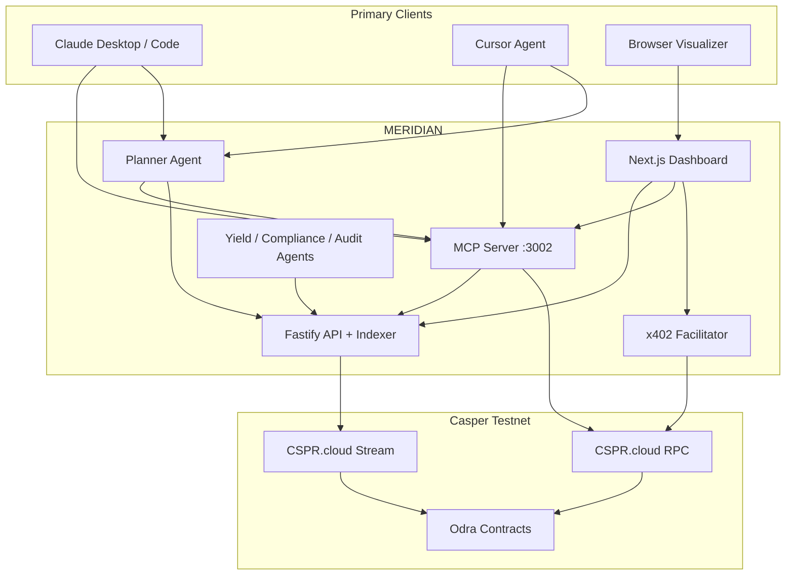

# MERIDIAN Product Story

**The design bible for the Casper AI Toolkit reference implementation.**

MERIDIAN is not a dashboard. MERIDIAN is an **agent-first protocol** where Claude, Cursor, and any MCP client interact with Casper through structured tools, wallet signing, and machine-native payments. The browser dashboard exists only to **visualize** what agents do.

---

## 1. What is MERIDIAN?

MERIDIAN is a **Casper-native Real World Asset (RWA) protocol** on testnet that demonstrates the full **Agentic Stack**:

```
AI Agent (Claude / Cursor / Planner)
        ↓
   MCP Server (13 tools)
        ↓
 Read Tool  OR  Unsigned Transaction
        ↓
   Human Wallet (CSPR.click / Casper Wallet)
        ↓
   Casper Blockchain (Odra contracts)
        ↓
   Backend Indexer (CSPR.cloud + PostgreSQL)
        ↓
   Agent Timeline (SSE)
        ↓
   Dashboard Visualizer
```

**On-chain:** MRWA token, ComplianceRegistry, StakingVault, YieldDistributor, MeridianAudit.

**Off-chain:** MCP server, x402 micropayments, Planner Agent, Yield/Compliance/Audit agents, live timeline streaming.

**Primary users:** Claude Desktop, Claude Code, Cursor Agent — not browser visitors.

---

## 2. Why does MERIDIAN exist?

Casper is building toward **autonomous, agent-driven finance**. MERIDIAN exists to prove that vision end-to-end:

| Layer       | MERIDIAN proves                                                        |
| ----------- | ---------------------------------------------------------------------- |
| MCP         | Agents discover and invoke blockchain tools without custom SDKs        |
| Wallet      | Humans retain custody; agents never hold private keys for user actions |
| x402        | Machines pay for premium resources without accounts or subscriptions   |
| Multi-agent | Yield, Compliance, and Audit agents coordinate with adversarial review |
| Indexer     | On-chain events become queryable agent context in seconds              |

MERIDIAN is the **reference implementation** judges can run from Claude or Cursor in under 60 seconds.

---

## 3. Why AI Agents?

Traditional dApps require humans to navigate UI, understand contracts, and click buttons. Agents invert this:

- **Natural language objectives** → structured protocol actions
- **Read tools first** → agents gather state before requesting signatures
- **Reasoning traces** → every decision is auditable, not a black box
- **Specialization** → Yield, Compliance, and Audit agents with different LLM providers
- **Adversarial review** → AuditAgent blocks bad YieldAgent decisions

The Planner Agent sits between the user's intent and MCP tools. It thinks, selects tools, executes reads, and only escalates to wallet signing when a write is required.

---

## 4. Why MCP?

**Model Context Protocol** is the standard interface between LLMs and external systems. MERIDIAN exposes Casper through MCP because:

1. **Claude Desktop and Cursor already speak MCP** — zero custom integration code for judges
2. **Tool discovery is automatic** — agents see names, descriptions, and schemas
3. **Read/write separation is explicit** — read tools return JSON; write tools return unsigned transactions
4. **Non-custodial by design** — MCP never signs; it only builds what the wallet signs

MERIDIAN MCP tools:

| Read (no wallet)         | Write (wallet required)                        |
| ------------------------ | ---------------------------------------------- |
| `get_token_info`         | `transfer_token`                               |
| `get_yield_rate`         | `register_holder`                              |
| `get_holder_yield`       | `revoke_holder` (compliance officer)           |
| `get_compliance_status`  | `delegate_stake` (native Casper, min 500 CSPR) |
| `list_validators`        | `deposit_to_vault` (MERIDIAN vault staking)    |
| `subscribe_audit` (x402) | `restake` (curator only)                       |
|                          | `distribute_rewards` (vault operator)          |

---

## 5. Why Wallet Signing?

Blockchain writes require cryptographic authorization. MERIDIAN enforces:

```
Agent proposes  →  Unsigned TransactionV1  →  Wallet popup  →  User approves  →  RPC broadcast
```

**Why not agent-held keys for user actions?**

- Regulatory and custody requirements for RWAs
- Human-in-the-loop for high-value transfers, compliance revocations, and staking
- Transparent UX: user sees **why** signing is required, **expected result**, **required role**, and **explorer link**

Agent keys exist only for **autonomous agent decisions** (YieldAgent restake proposals, AuditAgent attestations) — not for end-user wallet flows.

---

## 6. Why x402?

**x402** is HTTP-native micropayment (402 Payment Required). MERIDIAN uses it for premium audit access:

```
Agent requests audit data
        ↓
HTTP 402 + payment terms
        ↓
Wallet signs CSPR authorization
        ↓
Facilitator verifies + settles on-chain
        ↓
Resource unlocked → agent continues reasoning
```

This proves **machine-to-machine commerce** without API keys, accounts, or subscriptions. It is production-ready in MERIDIAN and must not be redesigned — only integrated deeper with agent workflows.

---

## 7. Why the Dashboard exists

The dashboard is an **Agent Activity Center**, not the product.

| Widget                               | Purpose                           |
| ------------------------------------ | --------------------------------- |
| Planner Thoughts                     | Live reasoning from Planner Agent |
| Tool Transcript                      | MCP calls with args and results   |
| Wallet Queue                         | Pending signatures and signed txs |
| Blockchain Status                    | Finality and explorer links       |
| Agent Decisions                      | Yield / Compliance / Audit output |
| Audit / Yield / Compliance Timelines | Indexed on-chain events           |
| x402 Payments                        | Micropayment flow status          |
| MCP Calls                            | Tool discovery and invocation log |

Judges watch the dashboard **while** driving Claude or Cursor. It updates via SSE — no manual refresh.

---

## 8. End-to-end architecture



**Data flow for a write action:**

1. User: "Register Mohamed as a compliant holder"
2. Planner parses objective, lists MCP tools, selects `get_compliance_status` (read)
3. Planner selects `register_holder` (write), calls MCP → unsigned tx
4. Trace events stream to dashboard via SSE
5. User signs in Casper Wallet
6. Transaction broadcasts to RPC
7. Indexer ingests `HolderRegistered` event
8. Dashboard compliance timeline updates automatically

---

## 9. Judge demo

**Duration:** 60 seconds to understand, 5 minutes for full flow.

### Setup (pre-demo)

- Claude Desktop or Cursor configured with MERIDIAN MCP (see sections 10–12)
- Casper Wallet on testnet with ≥500 CSPR
- Dashboard open: `https://meridian-frontend-kappa.vercel.app/dashboard/agents`

### Demo script

| Step | Actor | Action                                            | Visible result                                  |
| ---- | ----- | ------------------------------------------------- | ----------------------------------------------- |
| 1    | Judge | Ask Claude: "What is the current MRWA yield APY?" | `get_yield_rate` → JSON answer, no wallet       |
| 2    | Judge | Ask: "List top validators"                        | `list_validators` → validator list              |
| 3    | Judge | Ask: "Delegate 500 CSPR to validator X"           | Planner → `delegate_stake` → wallet popup       |
| 4    | Judge | Sign in wallet                                    | Timeline: broadcast → finality → indexer update |
| 5    | Judge | Ask: "Pay for premium audit report"               | x402 402 → wallet → unlock → audit data         |
| 6    | Judge | Watch dashboard                                   | Agent timeline streams all steps live           |

**Success criteria:** Judge never opens a "staking page" or "issue token page" — the agent drives everything.

---

## 10. Claude Desktop workflow

### Configuration

Add to Claude Desktop MCP config (`claude_desktop_config.json`):

```json
{
  "mcpServers": {
    "meridian": {
      "url": "https://meridian-mcp-server-94q4.onrender.com/mcp",
      "transport": "streamable-http"
    }
  }
}
```

For local development:

```json
{
  "mcpServers": {
    "meridian": {
      "command": "pnpm",
      "args": ["--filter", "@meridian/mcp-server", "start:stdio"],
      "env": {
        "MERIDIAN_MCP_TRANSPORT": "stdio",
        "BACKEND_URL": "https://meridian-backend-ikx8.onrender.com",
        "MERIDIAN_API_KEY": "<your-key>"
      }
    }
  }
}
```

### Example prompts

```
What is the current yield APY for MRWA?
```

```
Check compliance status for account-hash-abc123...
```

```
Build an unsigned transaction to transfer 1000 MRWA to account-hash-def456...
(I will sign in my wallet)
```

```
Delegate 500000000000 motes (500 CSPR) to validator 01abc...
```

### Wallet signing

Claude returns unsigned `TransactionV1` JSON. Copy to MERIDIAN dashboard MCP page or use CSPR.click signing flow. Private keys never leave the wallet.

See `docs/claude-integration.md` for full installation and conversation examples.

---

## 11. Claude Code workflow

Claude Code uses the same MCP server via project-level config.

```bash
# In MERIDIAN repo
claude mcp add meridian --transport stdio -- pnpm --filter @meridian/mcp-server start:stdio
```

**Agent loop:**

1. Read `MERIDIAN_PRODUCT_STORY.md` for context
2. Discover tools via MCP `tools/list`
3. Call read tools for state
4. Call write tools only when user confirms signing intent
5. Post execution traces via Planner API

Example session:

```
> Use MERIDIAN MCP to check if holder X is registered, then if not, prepare register_holder tx

Claude Code:
  [calls get_compliance_status]
  [reasoning: holder not registered]
  [calls register_holder → unsigned tx]
  "Sign this transaction in Casper Wallet..."
```

---

## 12. Cursor workflow

Cursor connects via `.cursor/mcp.json` in the repo root:

```json
{
  "mcpServers": {
    "meridian": {
      "url": "https://meridian-mcp-server-94q4.onrender.com/mcp"
    }
  }
}
```

**Judge guide:** Open Cursor → Agent mode → "Connect to MERIDIAN MCP and delegate 500 CSPR to the highest-yield validator."

Cursor discovers tools automatically. The Agent Activity Center dashboard shows the live transcript.

See `docs/cursor-integration.md` for demo prompts and tool transcripts.

---

## 13. Future roadmap

| Phase      | Deliverable                                                         |
| ---------- | ------------------------------------------------------------------- |
| **Now**    | Planner Agent, live timeline, Claude/Cursor configs, MCP metadata   |
| **Next**   | Agent-to-agent x402 (AuditAgent pays for premium data autonomously) |
| **Next**   | Threshold signing for agent key rotation                            |
| **Next**   | Mainnet deployment with issuer-controlled compliance                |
| **Future** | Cross-chain agent commerce via x402 + bridges                       |
| **Future** | On-chain agent registry (CEP for agent identity)                    |

---

## 14. Machine Economy vision

The end state is an economy where **software agents transact without human intervention** for routine operations, while humans retain veto power over high-risk actions.

MERIDIAN demonstrates the stack:

```
Agent A needs data from Agent B
        ↓
HTTP 402 (x402)
        ↓
Agent A wallet module pays 0.01 CSPR
        ↓
Agent B serves premium audit / yield / compliance data
        ↓
Both agents update on-chain attestations
```

Casper's low fees, fast finality, and native payment authorization make this viable on testnet today.

---

## 15. Agent-to-Agent Commerce

**Today:** User-facing agents call MCP; x402 gates premium audit reads.

**Tomorrow:**

| Scenario                       | Flow                                                              |
| ------------------------------ | ----------------------------------------------------------------- |
| YieldAgent needs audit         | Pays x402 for `subscribe_audit` → AuditAgent data                 |
| ComplianceAgent screens holder | Reads indexed events (free) → revokes via MCP write (officer key) |
| AuditAgent reviews YieldAgent  | Adversarial LLM review → blocks restake if policy violated        |
| Planner orchestrates           | Sequences read → x402 pay → write → trace → dashboard             |

**Principle:** Every agent interaction produces a **trace event** stored in PostgreSQL and streamed to the dashboard. Nothing is simulated.

---

## Live endpoints

| Service  | URL                                            |
| -------- | ---------------------------------------------- |
| Frontend | https://meridian-frontend-kappa.vercel.app     |
| Backend  | https://meridian-backend-ikx8.onrender.com     |
| MCP      | https://meridian-mcp-server-94q4.onrender.com  |
| x402     | https://meridian-x402-facilitator.onrender.com |
| Explorer | https://testnet.cspr.live                      |

---

## Repository map

| Path                       | Role                                   |
| -------------------------- | -------------------------------------- |
| `mcp-server/`              | **The product** — MCP tools for agents |
| `agents/planner-agent/`    | Objective → tool selection → traces    |
| `agents/yield-agent/`      | Autonomous yield decisions             |
| `agents/compliance-agent/` | Sanctions screening                    |
| `agents/audit-agent/`      | Adversarial review + summaries         |
| `backend/`                 | Indexer + API + trace SSE              |
| `frontend/`                | Agent Activity Center visualizer       |
| `x402-facilitator/`        | Micropayment verify/settle             |
| `contracts/`               | Odra smart contracts                   |
| `deployed/addresses.json`  | Testnet contract addresses             |

---

**This document is the source of truth.** When code and story diverge, fix the code or update this document — never silently drift.
