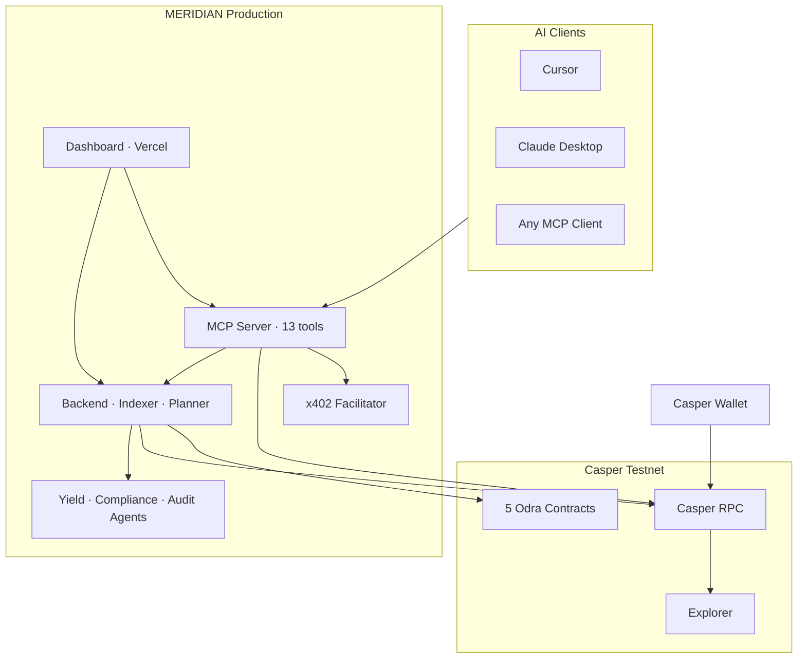

<p align="center">
  
</p>

<h1 align="center">MERIDIAN</h1>

<p align="center">
  <strong>The agent-first Casper RWA protocol.</strong><br/>
  Institutional compliance · native staking yield · autonomous AI — orchestrated through MCP, signed in your wallet, settled on-chain.
</p>

<p align="center">
  <em>Claude, Cursor, and any MCP client are the product. The dashboard is the proof.</em>
</p>

<p align="center">
  <a href="https://meridian-frontend-kappa.vercel.app/agent"><strong>Try the Live Demo</strong></a> ·
  <a href="https://github.com/mohamedwael201193/MERIDIAN">GitHub</a> ·
  <a href="https://testnet.cspr.live/deploy/d315fa7409d9abefb73c42e35b784632a9931c9f22c6397f499703732a74b2b4">On-Chain Proof</a>
</p>

<p align="center">
  
  
  
  
  
  
</p>

---

# Live production stack

Everything below is deployed and reachable today.

| Surface                     | URL                                                  |
| --------------------------- | ---------------------------------------------------- |
| **Briefing** (primary demo) | https://meridian-frontend-kappa.vercel.app/agent     |
| **Landing**                 | https://meridian-frontend-kappa.vercel.app/          |
| **MCP server**              | https://meridian-mcp-server-94q4.onrender.com/mcp    |
| **MCP health**              | https://meridian-mcp-server-94q4.onrender.com/health |
| **Backend API**             | https://meridian-backend-ikx8.onrender.com           |
| **x402 facilitator**        | https://meridian-x402-facilitator.onrender.com       |
| **Casper explorer**         | https://testnet.cspr.live                            |
| **Repository**              | https://github.com/mohamedwael201193/MERIDIAN        |

**Verified:** MCP health returns `status: ok`, `transport: http`, **13 tools**. Five Odra contract packages live on `casper-test` since 2026-06-28.

---

# On-chain proof

## Wallet-signed delegation — 500 CSPR, finalized

|                 |                                                                                                                      |
| --------------- | -------------------------------------------------------------------------------------------------------------------- |
| **Transaction** | [`d315fa74…b2b4`](https://testnet.cspr.live/deploy/d315fa7409d9abefb73c42e35b784632a9931c9f22c6397f499703732a74b2b4) |
| **Action**      | Native Casper delegate to auction pool                                                                               |
| **Amount**      | 500.00 CSPR                                                                                                          |
| **Result**      | Success · 2026-07-08                                                                                                 |
| **Flow**        | MCP `delegate_stake` → unsigned `TransactionV1` → Casper Wallet signature → RPC broadcast → explorer finality        |

<p align="center">
  
</p>

## x402 premium audit settlement

|                 |                                                                                                                     |
| --------------- | ------------------------------------------------------------------------------------------------------------------- |
| **Transaction** | [`2cb15743…a9e`](https://testnet.cspr.live/deploy/2cb15743a401711c10a253da93dd0f8b9e2f3a186221f6c8d8fe9727933d9a9e) |
| **Amount**      | 2.5 CSPR                                                                                                            |
| **Purpose**     | `subscribe_audit` micropayment via x402 facilitator                                                                 |

## Contract deployments

| Contract             | Deploy tx                                                                                                            |
| -------------------- | -------------------------------------------------------------------------------------------------------------------- |
| ComplianceRegistry   | [`930efed7…1bd8`](https://testnet.cspr.live/deploy/930efed7e6e20e36b4f3a4d03bbe0a5952160f277c9c14387659da5a311b1bd8) |
| MeridianToken (MRWA) | [`ca4c4b96…cc74`](https://testnet.cspr.live/deploy/ca4c4b96e6cf5638633b3123d5e54397b611256d656eea19938b5eb4493fcc74) |
| StakingVault         | [`e69eb51c…0326`](https://testnet.cspr.live/deploy/e69eb51cfe1fad92c581f953284266abb9fced6fb29e3d40e55de487338b0326) |
| YieldDistributor     | [`2c3ca30d…6e8`](https://testnet.cspr.live/deploy/2c3ca30dd90156bdd303837e16f152cfacf3fad531249f4e8030bab8deadc6e8)  |
| MeridianAudit        | [`1611925b…f08f`](https://testnet.cspr.live/deploy/1611925b3bf87df18855cac35dc42b9ecab695176cc49a6c4de8c9375034f08f) |

<p align="center">
  
</p>

---

# What is MERIDIAN?

MERIDIAN is a **Phase 1 complete** agent operating system for regulated real-world assets on Casper.

Users and AI agents express objectives in natural language. MERIDIAN discovers tools through **MCP**, reads live chain and indexer state, plans multi-step workflows, and returns **unsigned transactions** for wallet approval. No custodial keys. No fabricated blockchain data.

The Next.js dashboard visualizes protocol health, agent traces, MCP invocations, and transaction review — it is the evidence layer, not the control plane.

---

# Why it matters

Institutional RWAs require three capabilities that rarely coexist in one stack:

1. **Compliance** — jurisdiction, accreditation, and sanctions gating before every transfer.
2. **Yield** — auditable staking, delegation, and era-based distribution.
3. **Autonomous operations** — AI agents that plan, read, propose, and pause for human signature.

MERIDIAN unifies these under a single **MCP tool surface** so any AI client — Cursor, Claude Desktop, Claude Code, or future agent runtimes — can operate the same protocol without custom integration per frontend.

---

# Why Casper

Casper is not interchangeable infrastructure for this design.

| Casper capability           | MERIDIAN leverage                                                          |
| --------------------------- | -------------------------------------------------------------------------- |
| Native delegation & auction | `delegate_stake` + `list_validators` — live RPC, 500 CSPR minimum enforced |
| Odra contract packages      | Five wired contracts with role-based access control                        |
| CEP-18 + custom modules     | MRWA token with compliance-gated transfers                                 |
| CEP-88 event standard       | Indexer → PostgreSQL → MCP read tools                                      |
| CSPR.cloud + x402 pattern   | Native CSPR micropayments for premium audit feeds                          |

This architecture is **Casper-native**: delegation economics, payable vault semantics, and contract-to-contract reward distribution are first-class protocol features MERIDIAN builds on — not bolted-on EVM patterns.

---

# Why MCP

REST APIs trap agents inside one application. **Model Context Protocol** gives AI systems a universal contract:

- **Discoverability** — 13 typed tools with JSON Schema arguments.
- **Portability** — one server, every MCP client.
- **Safety semantics** — read tools vs write tools encoded in descriptions and planner traces.
- **Interoperability** — Cursor, Claude, OpenAI Agents, and any Streamable HTTP MCP consumer connect to the same endpoint.

**Production endpoint:** `https://meridian-mcp-server-94q4.onrender.com/mcp`  
**Transport:** Streamable HTTP (stdio available for local development)

MERIDIAN is the reference implementation of **RWA operations as MCP tools** — the pattern institutional agents will standardize on.

---

# Architecture



| Layer          | Role                                                            |
| -------------- | --------------------------------------------------------------- |
| **MCP server** | Tool catalog, read execution, unsigned TransactionV1 builder    |
| **Backend**    | CEP-88 indexer, REST API, planner, agent runner, SSE traces     |
| **Frontend**   | Briefing, MCP explorer, wallet flows, templates, marketplace UI |
| **x402**       | Verify / settle CSPR micropayments for premium resources        |
| **Contracts**  | Compliance, MRWA token, vault, yield distribution, audit        |
| **Agents**     | Autonomous yield, compliance, and audit decision loops          |

---

# Try it in 3 minutes

**For judges — copy these steps:**

### 1. Connect MCP in Cursor

```json
{
  "mcpServers": {
    "meridian": {
      "url": "https://meridian-mcp-server-94q4.onrender.com/mcp"
    }
  }
}
```

See `docs/cursor-integration.md` and `config/cursor/mcp.json`.

### 2. Run a read tool

```
Use MERIDIAN MCP get_token_info
```

Returns live deployed contract addresses from `deployed/addresses.json` plus indexed MRWA metadata.

### 3. Delegate on testnet

```
Use MERIDIAN MCP list_validators, then delegate_stake 500 CSPR to a validator.
My public key is 01...
```

Sign the returned unsigned transaction in Casper Wallet. Track finality on [CSPR.live](https://testnet.cspr.live).

### 4. Open the dashboard

https://meridian-frontend-kappa.vercel.app/agent — protocol ribbon, wallet panel, yield and compliance cards, agent command bar.

---

# Smart contracts

**Network:** `casper-test` · **Deployed:** 2026-06-28 · **Source:** `contracts/meridian-contracts/src/`

---

## ComplianceRegistry

| Field                 | Value                                                                                                                                   |
| --------------------- | --------------------------------------------------------------------------------------------------------------------------------------- |
| **Purpose**           | ERC-3643-style holder registry — attestation, jurisdiction, sanctions, revoke/reinstate                                                 |
| **Package**           | `contract-package-e6ed2d2eb8a1ffc7aa55a4158643a3682493d6f15f1e7123113a9c8534ee84f8`                                                     |
| **Contract**          | `hash-e6ed2d2eb8a1ffc7aa55a4158643a3682493d6f15f1e7123113a9c8534ee84f8`                                                                 |
| **Explorer**          | [View on CSPR.live](https://testnet.cspr.live/contract/hash-e6ed2d2eb8a1ffc7aa55a4158643a3682493d6f15f1e7123113a9c8534ee84f8)           |
| **Entry points**      | `register_holder`, `revoke`, `reinstate`, `is_compliant`, `get_attestation`, `get_rules`, `set_compliance_officer`, `set_token_address` |
| **Architecture role** | Transfer gate for MRWA; MCP `get_compliance_status`, `register_holder`, `revoke_holder`                                                 |
| **Dependencies**      | Wired to MeridianToken on deploy                                                                                                        |

---

## MeridianToken (MRWA)

| Field                 | Value                                                                                                                         |
| --------------------- | ----------------------------------------------------------------------------------------------------------------------------- |
| **Purpose**           | CEP-18 RWA token with compliance-enforced transfers and yield hooks                                                           |
| **Package**           | `contract-package-9bcac97d0e6723049fc130daa22f69e88a5d077a1df6b4e38536f0703bcaa2ca`                                           |
| **Contract**          | `hash-9bcac97d0e6723049fc130daa22f69e88a5d077a1df6b4e38536f0703bcaa2ca`                                                       |
| **Explorer**          | [View on CSPR.live](https://testnet.cspr.live/contract/hash-9bcac97d0e6723049fc130daa22f69e88a5d077a1df6b4e38536f0703bcaa2ca) |
| **Symbol**            | `MRWA`                                                                                                                        |
| **Entry points**      | `transfer`, `transfer_from`, `accrue_yield`, `revoke_holder`, `reinstate_holder`, `set_staking_vault`                         |
| **Architecture role** | Core RWA asset; MCP `get_token_info`, `transfer_token`                                                                        |
| **Dependencies**      | ComplianceRegistry, StakingVault                                                                                              |

---

## StakingVault

| Field                 | Value                                                                                                                         |
| --------------------- | ----------------------------------------------------------------------------------------------------------------------------- |
| **Purpose**           | Staked asset custody, validator delegation, reward distribution orchestration                                                 |
| **Package**           | `contract-package-3062ba32a4ef4d3fd0fc5c9d0895980b7bbbcc5f407590d1b14c60ca631300c7`                                           |
| **Contract**          | `hash-3062ba32a4ef4d3fd0fc5c9d0895980b7bbbcc5f407590d1b14c60ca631300c7`                                                       |
| **Explorer**          | [View on CSPR.live](https://testnet.cspr.live/contract/hash-3062ba32a4ef4d3fd0fc5c9d0895980b7bbbcc5f407590d1b14c60ca631300c7) |
| **Entry points**      | `deposit`, `restake`, `undelegate`, `claim_rewards`, `distribute_rewards`, `forward_distribute`                               |
| **Architecture role** | Yield engine; MCP `restake`; native delegation via separate `delegate_stake` tool                                             |
| **Dependencies**      | MeridianToken, YieldDistributor                                                                                               |

---

## YieldDistributor

| Field                 | Value                                                                                                                         |
| --------------------- | ----------------------------------------------------------------------------------------------------------------------------- |
| **Purpose**           | Era-based reward splitting, holder registration, protocol fee                                                                 |
| **Package**           | `contract-package-378bf2fddb1e574f39014bff6280f101c264da6fc4c629ad4e8c0d8ce55a6c34`                                           |
| **Contract**          | `hash-378bf2fddb1e574f39014bff6280f101c264da6fc4c629ad4e8c0d8ce55a6c34`                                                       |
| **Explorer**          | [View on CSPR.live](https://testnet.cspr.live/contract/hash-378bf2fddb1e574f39014bff6280f101c264da6fc4c629ad4e8c0d8ce55a6c34) |
| **Entry points**      | `register_holder`, `distribute`, `pending_yield`, `set_protocol_fee_bps`                                                      |
| **Architecture role** | Authorized caller for vault reward distribution pipeline                                                                      |
| **Dependencies**      | StakingVault, MeridianToken                                                                                                   |

---

## MeridianAudit

| Field                 | Value                                                                                                                         |
| --------------------- | ----------------------------------------------------------------------------------------------------------------------------- |
| **Purpose**           | On-chain audit summary attestations and CEP-88 event trail                                                                    |
| **Package**           | `contract-package-1d8bc0bbbb6dda232afcff2afa257e7572d1ac33c518b1852b9a34c707493d84`                                           |
| **Contract**          | `hash-1d8bc0bbbb6dda232afcff2afa257e7572d1ac33c518b1852b9a34c707493d84`                                                       |
| **Explorer**          | [View on CSPR.live](https://testnet.cspr.live/contract/hash-1d8bc0bbbb6dda232afcff2afa257e7572d1ac33c518b1852b9a34c707493d84) |
| **Entry points**      | `submit_summary`, `get_summary`, `get_latest_summaries`, `set_audit_signer`                                                   |
| **Architecture role** | Audit agent output; MCP `subscribe_audit`                                                                                     |
| **Dependencies**      | Fed by indexer events                                                                                                         |

---

# MCP — 13 tools

MERIDIAN exposes the full RWA lifecycle as MCP tools. External agents install `skills/MERIDIAN/SKILL.md` or `frontend/public/meridian-skill.md` and immediately gain read-before-write discipline, x402 workflow, and Casper wallet approval rules.

## Read tools (6)

No wallet required. Execute instantly against live indexer and RPC.

| Tool                    | What it returns                                             |
| ----------------------- | ----------------------------------------------------------- |
| `get_token_info`        | MRWA metadata, supply, all five deployed contract addresses |
| `get_yield_rate`        | Estimated APY (bps), total staked, last distribution era    |
| `get_holder_yield`      | Yield distribution history from PostgreSQL indexer          |
| `get_compliance_status` | Holder registry status by Casper account hash               |
| `list_validators`       | Live auction validators with stake weights                  |
| `subscribe_audit`       | Premium audit summaries — x402 payment unlocks full feed    |

### Example read workflow

```
Objective: "What is the MRWA yield situation?"
  → get_token_info
  → get_yield_rate
  → get_holder_yield
  → Summarize with real fields: estimatedApyBps, totalStaked, lastDistribution
```

## Write tools (7)

Return unsigned `TransactionV1` JSON. User signs in Casper Wallet. MCP never holds keys.

| Tool                 | On-chain action                              | Phase 1            |
| -------------------- | -------------------------------------------- | ------------------ |
| `transfer_token`     | MRWA transfer to compliant holder            | ✅ Wallet-signed   |
| `register_holder`    | ComplianceRegistry registration              | ✅ Wallet-signed   |
| `revoke_holder`      | Compliance officer revocation                | ✅ Wallet-signed   |
| `delegate_stake`     | Native Casper delegation (min 500 CSPR)      | ✅ Proven on-chain |
| `restake`            | Vault validator migration (curator role)     | ✅ Wallet-signed   |
| `deposit_to_vault`   | StakingVault deposit with attached CSPR      | Phase 2            |
| `distribute_rewards` | Era reward distribution via YieldDistributor | Phase 2            |

### Example write workflow

```
Objective: "Delegate 500 CSPR to the top validator"
  → list_validators (read)
  → delegate_stake with callerPublicKey + validator + amount (write)
  → Present unsigned transaction
  → User signs in Casper Wallet
  → Broadcast → explorer link
```

### Connect any MCP client

| Client                | Configuration                                           |
| --------------------- | ------------------------------------------------------- |
| **Cursor**            | `config/cursor/mcp.json` → Streamable HTTP URL          |
| **Claude Desktop**    | `config/claude/README.md`, `docs/claude-integration.md` |
| **Claude Code / CLI** | Point at production `/mcp` endpoint                     |
| **Custom agents**     | Install `skills/MERIDIAN/SKILL.md`                      |

---

# AI architecture

## Planner

`backend/src/planner/planner-service.ts` converts natural-language objectives into ordered tool plans:

1. Receive objective via `POST /api/v1/planner/execute`
2. Discover 13-tool catalog
3. Match intent → read/write sequence
4. Execute reads against backend + RPC
5. Build unsigned transactions for writes
6. Stream traces via SSE (`/api/v1/traces/stream`)

The Briefing page (`/agent`) is the primary planner interface.

## Agent skills

| Asset                     | Location                            | Purpose                                                       |
| ------------------------- | ----------------------------------- | ------------------------------------------------------------- |
| **MERIDIAN skill**        | `skills/MERIDIAN/SKILL.md`          | Official agent playbook — tool ordering, x402, approval gates |
| **Public skill**          | `frontend/public/meridian-skill.md` | Served at `/meridian-skill.md` for one-click install          |
| **Prompt library**        | `frontend/lib/prompt-library.ts`    | 111 judge-ready prompts across 12 categories                  |
| **Marketplace templates** | `frontend/lib/agent-marketplace.ts` | Treasury, Compliance, Yield, Portfolio, Audit agents          |

Installing the skill teaches an external AI:

- Read-before-write ordering (`get_compliance_status` before transfers)
- 500 CSPR delegation minimum
- x402 payment flow for `subscribe_audit`
- Human approval at every write
- Explorer links after broadcast

## Policy engine & approval

- Template `policies[]` in marketplace agents
- Planner emits `wallet_required` traces before any write
- `TransactionReviewCard` in dashboard for compact wallet approval
- Backend agents (Yield, Compliance, Audit) post decisions to `/api/v1/decisions` — human review gate via Redis coordination

## Memory

- Template `memorySeeds` persist in local agent profile
- `meridian_agent_decisions` and `meridian_agent_traces` in PostgreSQL for audit trail

## Backend agents

Three autonomous agents run on Render when `AGENTS_ENABLED=true`:

- **YieldAgent** — APY analysis, restake recommendations
- **ComplianceAgent** — registry monitoring, sanctions alignment
- **AuditAgent** — summary generation, adversarial review

Agents read live backend state, produce structured JSON decisions, and integrate with the same MCP tool catalog.

---

# x402 machine economy

Native CSPR micropayments gate premium resources.

| Resource                                                    | Access                  |
| ----------------------------------------------------------- | ----------------------- |
| MCP read tools (except audit)                               | Open                    |
| `subscribe_audit`                                           | x402 — 2.5 CSPR default |
| Facilitator `/api/yield-rate`, `/api/validator-performance` | x402                    |

**Facilitator:** https://meridian-x402-facilitator.onrender.com  
**Flow:** 402 response → wallet payment → `verify` → `settle` → retry with payment header

100 successful testnet settlements recorded in Phase 8.5 validation.

---

# Dashboard

Production Next.js 14 App Router. Primary routes (HTTP 200 verified):

| URL            | Experience                                     |
| -------------- | ---------------------------------------------- |
| `/agent`       | **Briefing** — command center, wallet, planner |
| `/agents`      | Agent Activity Center                          |
| `/activity`    | History — indexed events and traces            |
| `/mcp`         | MCP Tool Explorer — 13 tools, instant reads    |
| `/templates`   | Pre-built missions                             |
| `/examples`    | 111-prompt library                             |
| `/marketplace` | Five installable agent templates               |
| `/dashboard`   | Operations — protocol KPIs                     |
| `/staking`     | Delegation and vault panels                    |
| `/compliance`  | Holder registry                                |
| `/audit`       | Audit summaries                                |
| `/x402`        | Payment demonstration                          |

Nav labels: Briefing = `/agent` · History = `/activity` · Operations = `/dashboard` · Setup = `/start`

---

# Phase 1 deliverables

| Deliverable                 | Evidence                                                                                                              |
| --------------------------- | --------------------------------------------------------------------------------------------------------------------- |
| 5 Odra contracts on testnet | `deployed/addresses.json` + explorer links                                                                            |
| 13-tool MCP server          | Production health endpoint                                                                                            |
| Wallet-signed delegation    | [Explorer proof](https://testnet.cspr.live/deploy/d315fa7409d9abefb73c42e35b784632a9931c9f22c6397f499703732a74b2b4)   |
| x402 micropayments          | [Settlement proof](https://testnet.cspr.live/deploy/2cb15743a401711c10a253da93dd0f8b9e2f3a186221f6c8d8fe9727933d9a9e) |
| CEP-88 indexer → Postgres   | Backend `/api/v1/events`, `/api/v1/traces`                                                                            |
| Planner + agent traces      | `/agent`, SSE stream                                                                                                  |
| ERC-3643 compliance module  | ComplianceRegistry live                                                                                               |
| Multi-agent backend         | Yield, Compliance, Audit on Render                                                                                    |
| Production frontend         | Vercel deployment                                                                                                     |
| Agent skill + 111 prompts   | `skills/MERIDIAN/SKILL.md`, prompt library                                                                            |

---

# Phase 2 roadmap

Intentional expansion — not Phase 1 scope.

| Initiative                         | Description                                                                               |
| ---------------------------------- | ----------------------------------------------------------------------------------------- |
| **Advanced vault deposits**        | Browser payable routing for `StakingVault.deposit` via Odra `__cargo_purse` TransactionV1 |
| **Automated reward distribution**  | YieldDistributor execution pipeline for era-based `distribute_rewards`                    |
| **Mainnet deployment**             | Production network gates, audited upgrades, operator runbook                              |
| **On-chain agent marketplace**     | Registry, reputation, revenue share for third-party MCP skills                            |
| **Autonomous agent economy**       | Agent-to-agent x402 treasury and micropayment loops                                       |
| **Session keys & gas abstraction** | Frictionless institutional onboarding                                                     |
| **Multi-asset support**            | Beyond MRWA — additional RWA instrument types                                             |
| **Enterprise KYC pipeline**        | Automated OFAC/EU feed integration in ComplianceAgent                                     |
| **Developer SDK**                  | Published npm packages for MERIDIAN tool integration                                      |
| **Demo video**                     | 90-second judge walkthrough                                                               |
| **Indexer scale-up**               | Historical backfill for full-era analytics                                                |

### Startup vision

Revenue lines: x402 premium data feeds · institutional compliance APIs · agent marketplace commission · managed indexer SLA for RWA issuers.

---

# Technical stack

| Layer     | Technology                         |
| --------- | ---------------------------------- |
| Contracts | Rust, Odra 2.8.2                   |
| MCP       | TypeScript, Streamable HTTP        |
| Backend   | Fastify, PostgreSQL, Upstash Redis |
| Frontend  | Next.js 14, MUI, CSPR.click        |
| x402      | CSPR.cloud facilitator pattern     |
| Deploy    | Vercel + Render                    |

---

# Repository structure

```
MERIDIAN/
├── contracts/meridian-contracts/   # 5 deployed Odra contracts
├── mcp-server/                     # 13 MCP tools
├── backend/                        # API, indexer, planner, agents
├── frontend/                       # Dashboard
├── x402-facilitator/               # Payment verify/settle
├── agents/                         # Yield, Compliance, Audit
├── packages/meridian-casper-sdk/   # Casper + x402 SDK
├── deployed/addresses.json         # Testnet addresses
├── skills/MERIDIAN/SKILL.md        # Agent skill
└── config/cursor/mcp.json          # Cursor MCP config
```

---

# Run locally

```bash
git clone https://github.com/mohamedwael201193/MERIDIAN.git
cd MERIDIAN && pnpm install
pnpm --filter @meridian/casper-sdk build
pnpm --filter @meridian/mcp-server build
pnpm --filter @meridian/backend run migrate
pnpm --filter @meridian/backend start
pnpm --filter @meridian/frontend dev
```

Environment template: `docs/ENVIRONMENT_REQUIREMENTS.md` (local). Never commit `.env` or PEM keys.

---

# Security model

| Surface   | Design                                           |
| --------- | ------------------------------------------------ |
| Wallet    | Non-custodial — CSPR.click + Casper Wallet only  |
| MCP       | Public keys in args; no private key storage      |
| Backend   | `X-API-Key` on `/api/v1/*`                       |
| Contracts | Odra Ownable + AccessControl + timelock upgrades |
| x402      | Redis replay guard                               |

---

# Why MERIDIAN wins

- **Real AI surface** — 13 MCP tools on production HTTP, not slides.
- **Real wallet path** — 500 CSPR delegate finalized on testnet.
- **Real contracts** — five Odra packages wired and explorer-verified.
- **Casper-native** — delegation, CEP-88, CSPR x402, auction validators.
- **Institutional framing** — ERC-3643 compliance, audit trail, approval gates.
- **Agent interoperability** — one MCP server, every AI client.

---

# Links

| Resource     | URL                                               |
| ------------ | ------------------------------------------------- |
| Live demo    | https://meridian-frontend-kappa.vercel.app/agent  |
| GitHub       | https://github.com/mohamedwael201193/MERIDIAN     |
| MCP          | https://meridian-mcp-server-94q4.onrender.com/mcp |
| Cursor setup | `docs/cursor-integration.md`                      |
| Claude setup | `docs/claude-integration.md`                      |
| Agent skill  | `skills/MERIDIAN/SKILL.md`                        |

---

<p align="center">
  <strong>MERIDIAN</strong> — Phase 1 complete on Casper testnet.<br/>
  MCP · Wallet · Chain · Evidence.
</p>
