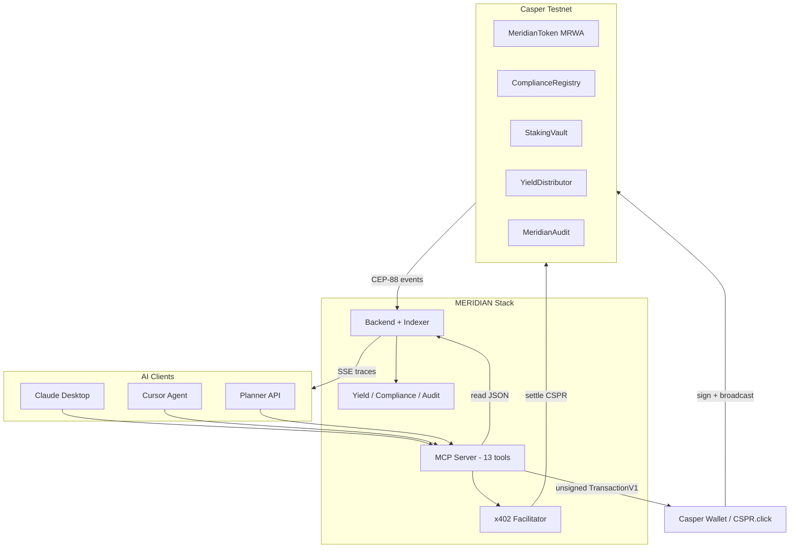
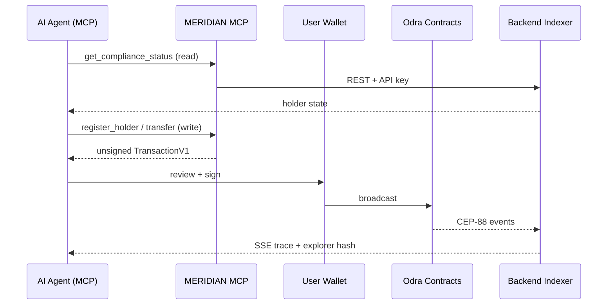
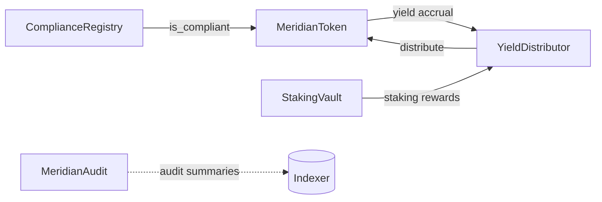
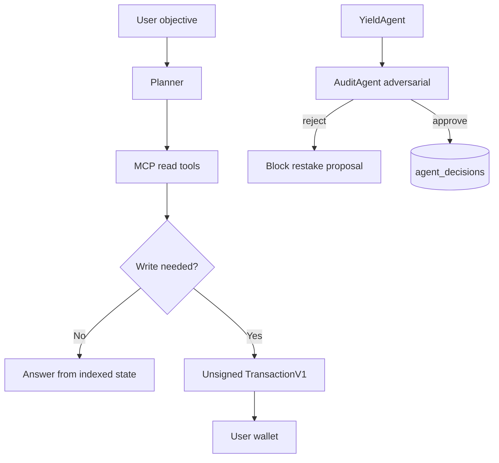

<p align="center">
  
</p>

<h1 align="center">MERIDIAN</h1>

<p align="center">
  <strong>The agent-first Casper RWA protocol.</strong><br/>
  Institutional compliance, native staking yield, and autonomous AI — orchestrated through MCP, signed in your wallet, settled on-chain.
</p>

<p align="center">
  <em>Claude, Cursor, and any MCP client are the product. The dashboard is the proof.</em>
</p>

<p align="center">
  <a href="https://github.com/mohamedwael201193/MERIDIAN/actions"></a>
  <a href="https://www.apache.org/licenses/LICENSE-2.0"></a>
  
  
  
  
  
  
</p>

<p align="center">
  <a href="https://meridian-frontend-kappa.vercel.app">Live Dashboard</a> ·
  <a href="https://meridian-mcp-server-94q4.onrender.com/health">MCP Health</a> ·
  <a href="https://testnet.cspr.live">Casper Explorer</a> ·
  <a href="MERIDIAN_PRODUCT_STORY.md">Product Story</a> ·
  <a href="docs/reports/README.md">Phase Reports</a>
</p>

---

## Status legend

Every capability in this document is classified honestly:

| Label                      | Meaning                                                         |
| -------------------------- | --------------------------------------------------------------- |
| ✅ **Live**                | Deployed and reachable on Casper testnet or production URLs     |
| ✅ **Working**             | Verified by phase reports, integration tests, or live MCP calls |
| ✅ **Implemented**         | Code exists, ships in this repository                           |
| ✅ **Production Ready**    | Running on Render / Vercel with documented ops                  |
| 🟡 **Planned for Phase 2** | Designed, documented, not yet shipped                           |
| 🟡 **Planned for Mainnet** | Testnet-complete; mainnet gates remain                          |
| 🟡 **Future Roadmap**      | Vision in `MERIDIAN_PRODUCT_STORY.md`                           |

---

# Demo

### Live application (✅ Live)

| Surface                | URL                                                         |
| ---------------------- | ----------------------------------------------------------- |
| Agent Activity Center  | https://meridian-frontend-kappa.vercel.app/dashboard/agents |
| Onboarding / MCP setup | https://meridian-frontend-kappa.vercel.app/start            |
| AI Playground          | https://meridian-frontend-kappa.vercel.app/playground       |
| MCP Tools page         | https://meridian-frontend-kappa.vercel.app/mcp              |

### Demo video (🟡 Planned)

A 90-second judge demo video is specified in `docs/FINAL_PROMPT.md` (`demos/video/meridian-demo.mp4`) but **is not committed to this repository**. Until it ships, use the live dashboard and MCP health endpoint as demo evidence.

### Architecture at a glance



### Brand assets (✅ Implemented)

| Asset             | Path                          |
| ----------------- | ----------------------------- |
| Logo              | `frontend/public/logo.svg`    |
| Favicon           | `frontend/public/favicon.svg` |
| Cursor MCP config | `config/cursor/mcp.json`      |

No MERIDIAN-specific dashboard screenshots are stored in the repo. Visual proof is on the **live Vercel deployment** above.

---

# What is MERIDIAN?

MERIDIAN is a **Casper-native Real World Asset (RWA) protocol** that makes institutional token lifecycle — issuance, compliance, staking yield, audit, and distribution — operable by **AI agents** through the **Model Context Protocol (MCP)**, with **human wallet custody** for every write.

**Central thesis** (from `docs/MERIDIAN_ENGINEERING_BIBLE.md` / strategy dossier):

> The first protocol where any RWA token natively earns Casper staking yield through AI-managed ERC-3643-compliant contracts that call the system auction directly.

MERIDIAN is the **reference implementation** for the [Casper AI Toolkit](https://www.casper.network/ai): MCP servers, x402 micropayments, CSPR.click wallet flows, Odra contracts, and CSPR.cloud indexing — composed into one honest, testnet-live stack.

### Why Casper — and why not elsewhere?

| Capability                     | Casper                                    | Typical EVM L2                    |
| ------------------------------ | ----------------------------------------- | --------------------------------- |
| Native staking auction         | ✅ System contract `Delegate` entry point | ❌ External staking contracts     |
| TransactionV1 + wallet signing | ✅ Casper Wallet, CSPR.click              | Different tx model                |
| WASM contracts (Odra)          | ✅ Upgradeable packages                   | Solidity-only or bridge           |
| x402 on native CSPR            | ✅ Live facilitator in this repo          | Token approvals + gas abstraction |
| Low finality latency           | ✅ Era-based finality                     | Variable                          |
| AI Toolkit first-class         | ✅ MCP + x402 + agent skills              | Fragmented                        |

MERIDIAN stakes **native CSPR** through the protocol auction (`delegate_stake` MCP tool). Vault logic (`StakingVault`) calls `system::get_auction()` via Odra subcalls — not a synthetic staking derivative. That coupling is **impossible to fake** on chains without a native auction module.

---

# The Problem

Institutional RWAs face four simultaneous failures in today's market:

1. **Compliance is off-chain.** Cap tables, sanctions screening, and investor accreditation live in spreadsheets. On-chain transfers ignore ERC-3643-style rules until it is too late.

2. **Yield is disconnected.** Token holders do not automatically participate in chain-native staking economics. Issuers bolt on custodial staking products with opaque counterparty risk.

3. **Operations do not scale.** Every transfer, registration, delegation, and distribution requires a human operator clicking through a dashboard. There is no standard agent interface.

4. **Machine commerce has no payment rail.** Premium data (audit feeds, sanctions lists, validator analytics) is sold via API keys and subscriptions — unusable for autonomous agents.

**Pain points MERIDIAN targets:**

- Regulated issuers need **on-chain compliance** before transfer
- Holders want **native CSPR yield**, not wrapped substitutes
- AI systems need **MCP tool discovery**, not bespoke SDKs per chain
- Agents need **micropayments** (x402), not Stripe accounts
- Institutions need **audit trails** humans and agents can both verify

---

# Solution

MERIDIAN implements a full protocol lifecycle on Casper testnet:



| Stage            | Component                           | Status                        |
| ---------------- | ----------------------------------- | ----------------------------- |
| Asset            | MeridianToken (MRWA, fixed supply)  | ✅ Live                       |
| Compliance       | ComplianceRegistry (ERC-3643-style) | ✅ Live                       |
| Yield source     | Native delegation + StakingVault    | ✅ Live / partial MCP         |
| Distribution     | YieldDistributor                    | ✅ Live contract              |
| Audit            | MeridianAudit + AuditAgent          | ✅ Live                       |
| Agent execution  | MCP 13 tools + Planner              | ✅ Live                       |
| Machine payments | x402 facilitator                    | ✅ Live (100/100 settlements) |
| Visualization    | Next.js dashboard + SSE             | ✅ Live                       |

---

# Live Demo — what actually happens

This is the **60-second judge path** from `MERIDIAN_PRODUCT_STORY.md` and `docs/JUDGE_DEMO.md`. Every step uses production services — nothing simulated.

1. **Open Cursor or Claude Desktop** with MERIDIAN MCP configured (`config/cursor/mcp.json` → `https://meridian-mcp-server-94q4.onrender.com/mcp`). ✅ Working

2. **Ask:** _"What is the MRWA yield APY?"_ → Agent calls `get_yield_rate`. ✅ Working — returns indexed APY from backend.

3. **Ask:** _"List validators and delegate 500 CSPR."_ → Agent calls `list_validators` then `delegate_stake`. ✅ Working — returns unsigned `TransactionV1` with `approvals: []`.

4. **Wallet** — User signs in Casper Wallet or CSPR.click. ✅ Implemented in frontend (`WalletExecutionPanel`, `TransactionReviewCard`).

5. **Broadcast** — Signed deploy submitted via RPC. ✅ Implemented (`frontend/src/app/api/transactions/submit/route.ts`).

6. **Explorer** — Hash appears on https://testnet.cspr.live. ✅ Working when user completes signing.

7. **Dashboard** — Agent Activity Center streams planner traces, MCP calls, and finality via SSE. ✅ Live at `/dashboard/agents`.

**Premium audit path (x402):**

1. `subscribe_audit` without payment → `402 PAYMENT_REQUIRED`. ✅ Working
2. Wallet/facilitator settles 2.5 CSPR minimum native transfer. ✅ Working — see Transaction Proofs
3. Retry with `paymentHeader` → audit summaries + indexed events. ✅ Working

---

# What Was Built

## Frontend (✅ Live — Vercel)

Next.js 14 App Router dashboard — **visualizer only**, not the primary product.

| Route                                  | Purpose                              |
| -------------------------------------- | ------------------------------------ |
| `/`                                    | Landing                              |
| `/start`                               | MCP + wallet onboarding wizard       |
| `/dashboard/agents`                    | Agent Activity Center (primary demo) |
| `/playground`                          | Natural language → planner           |
| `/prompts`                             | 111 prompt library                   |
| `/mcp`                                 | MCP tool reference + invoke UI       |
| `/x402`                                | x402 payment demo                    |
| `/compliance`                          | Holder registry UI                   |
| `/staking`                             | Delegation + vault panels            |
| `/audit`                               | Audit summaries                      |
| `/marketplace`                         | Agent marketplace shell              |
| `/missions`, `/templates`, `/examples` | Operator templates                   |

Stack: React, MUI, Tailwind v4 tokens (`frontend/src/design/`), CSPR.click, SSE hooks.

## Backend (✅ Production Ready — Render)

Fastify API + CSPR.cloud indexer + Planner Agent.

- REST API with `X-API-Key` auth
- PostgreSQL via Supabase (8 migrations)
- Upstash Redis for agent coordination + x402 replay guard
- SSE trace streaming for dashboard
- Embedded Yield / Compliance / Audit agents

**URLs:** `https://meridian-backend-ikx8.onrender.com` (MCP config) and `https://meridian-backend-cu88.onrender.com` (deployment report canonical). Both documented in repo; confirm active instance via `/health`.

## Smart Contracts (✅ Live — Casper testnet)

Five Odra 2.8.2 contracts deployed 2026-06-28. See Smart Contracts section.

## MCP Server (✅ Production Ready)

`@meridian/mcp-server` — 13 tools, stdio + Streamable HTTP.

- Health: https://meridian-mcp-server-94q4.onrender.com/health
- Endpoint: `POST /mcp`
- **Non-custodial:** no private keys on server

## x402 Facilitator (✅ Production Ready)

`@meridian/x402-facilitator` — verify/settle native CSPR payments.

- Combined facilitator + resource on Render
- 100/100 on-chain settlements verified (`docs/reports/x402_100_settlement_results.json`)

## Planner (✅ Implemented)

`backend/src/planner/planner-service.ts` — objective → tool selection → read-first → honest write blocking → traces.

Endpoint: `POST /api/v1/planner/execute`

## AI Agents (✅ Implemented — decision layer)

| Agent           | Package                    | Output                                          |
| --------------- | -------------------------- | ----------------------------------------------- |
| YieldAgent      | `agents/yield-agent/`      | Era evaluation, whitelist-constrained proposals |
| ComplianceAgent | `agents/compliance-agent/` | OFAC/EU screening decisions                     |
| AuditAgent      | `agents/audit-agent/`      | Adversarial yield review + summaries            |

Each posts to `POST /api/v1/decisions`. On-chain submission of agent writes: 🟡 partially deferred per Phase 8.5 report.

## Infrastructure (✅ Production Ready)

| Layer         | Provider            |
| ------------- | ------------------- |
| API + indexer | Render              |
| Database      | Supabase PostgreSQL |
| Cache         | Upstash Redis       |
| RPC + events  | CSPR.cloud          |
| Frontend      | Vercel              |
| Chain         | Casper testnet      |

## Wallet (✅ Implemented)

CSPR.click + Casper Wallet extension. MCP writes always return unsigned deploys for user signing.

## Monitoring (✅ Implemented)

- MCP `/metrics` (Prometheus)
- Phase reports with PASS/FAIL matrices (`docs/reports/`)
- `MCP_CONNECTION_REPORT.md` for Cursor integration verification

---

# Smart Contracts

All contracts deployed on **Casper testnet** (`casper-test`). Source: `deployed/addresses.json`.

### MeridianToken (MRWA) — ✅ Live

| Field             | Value                                                                                                                                                                               |
| ----------------- | ----------------------------------------------------------------------------------------------------------------------------------------------------------------------------------- |
| **Purpose**       | ERC-3643-aligned RWA token; fixed supply at deployment                                                                                                                              |
| **Contract hash** | [`hash-9bcac97d0e6723049fc130daa22f69e88a5d077a1df6b4e38536f0703bcaa2ca`](https://testnet.cspr.live/contract/hash-9bcac97d0e6723049fc130daa22f69e88a5d077a1df6b4e38536f0703bcaa2ca) |
| **Key methods**   | `transfer`, `transfer_from`, `balance_of`, `accrue_yield`, `set_compliance_registry`, `set_staking_vault`                                                                           |
| **Security**      | Compliance hook via ComplianceRegistry; upgrade timelock                                                                                                                            |
| **Interactions**  | ComplianceRegistry gates transfers; YieldDistributor accrues yield                                                                                                                  |

### ComplianceRegistry — ✅ Live

| Field             | Value                                                                                                                                                                               |
| ----------------- | ----------------------------------------------------------------------------------------------------------------------------------------------------------------------------------- |
| **Purpose**       | On-chain holder registry, country codes, accreditation, revoke/reinstate                                                                                                            |
| **Contract hash** | [`hash-e6ed2d2eb8a1ffc7aa55a4158643a3682493d6f15f1e7123113a9c8534ee84f8`](https://testnet.cspr.live/contract/hash-e6ed2d2eb8a1ffc7aa55a4158643a3682493d6f15f1e7123113a9c8534ee84f8) |
| **Key methods**   | `register_holder`, `revoke`, `reinstate`, `is_compliant`, `update_rules`                                                                                                            |
| **Security**      | CONTRACT_OWNER, COMPLIANCE_OFFICER roles; 24h timelock on rule changes                                                                                                              |
| **Interactions**  | MeridianToken checks compliance before transfer                                                                                                                                     |

### StakingVault — ✅ Live

| Field             | Value                                                                                                                                                                               |
| ----------------- | ----------------------------------------------------------------------------------------------------------------------------------------------------------------------------------- |
| **Purpose**       | CSPR deposits, native auction delegation, restake, reward claims                                                                                                                    |
| **Contract hash** | [`hash-3062ba32a4ef4d3fd0fc5c9d0895980b7bbbcc5f407590d1b14c60ca631300c7`](https://testnet.cspr.live/contract/hash-3062ba32a4ef4d3fd0fc5c9d0895980b7bbbcc5f407590d1b14c60ca631300c7) |
| **Key methods**   | `deposit` (payable), `restake`, `undelegate`, `claim_rewards`, `distribute_rewards`                                                                                                 |
| **Security**      | VALIDATOR_CURATOR role; validator whitelist                                                                                                                                         |
| **Interactions**  | Calls system auction; linked to YieldDistributor                                                                                                                                    |

### YieldDistributor — ✅ Live

| Field             | Value                                                                                                                                                                               |
| ----------------- | ----------------------------------------------------------------------------------------------------------------------------------------------------------------------------------- |
| **Purpose**       | Era-based yield distribution to MRWA holders                                                                                                                                        |
| **Contract hash** | [`hash-378bf2fddb1e574f39014bff6280f101c264da6fc4c629ad4e8c0d8ce55a6c34`](https://testnet.cspr.live/contract/hash-378bf2fddb1e574f39014bff6280f101c264da6fc4c629ad4e8c0d8ce55a6c34) |
| **Key methods**   | `register_holder`, `distribute`, `pending_yield`, `set_protocol_fee_bps`                                                                                                            |
| **Security**      | Protocol fee timelock; holder registration                                                                                                                                          |
| **Interactions**  | Reads vault rewards; updates MeridianToken yield accrual                                                                                                                            |

### MeridianAudit — ✅ Live

| Field             | Value                                                                                                                                                                               |
| ----------------- | ----------------------------------------------------------------------------------------------------------------------------------------------------------------------------------- |
| **Purpose**       | On-chain audit summary hashes from AuditAgent                                                                                                                                       |
| **Contract hash** | [`hash-1d8bc0bbbb6dda232afcff2afa257e7572d1ac33c518b1852b9a34c707493d84`](https://testnet.cspr.live/contract/hash-1d8bc0bbbb6dda232afcff2afa257e7572d1ac33c518b1852b9a34c707493d84) |
| **Key methods**   | `submit_summary`, `get_summary`, `get_latest_summaries`, `set_audit_signer`                                                                                                         |
| **Security**      | Audit signer role; 24h timelock                                                                                                                                                     |
| **Interactions**  | Feeds `subscribe_audit` MCP tool via indexer                                                                                                                                        |

### Contract interaction diagram



---

# AI Architecture

MERIDIAN runs **specialized agents** instead of one monolithic LLM — reducing context pollution, provider lock-in, and unchecked financial actions.

### Planner Agent (✅ Implemented)

- **Input:** Natural language objective
- **Flow:** Discover MCP tools → execute reads → escalate to writes only with intent → stream traces
- **Memory:** Session traces in `meridian_agent_traces` (PostgreSQL)
- **Endpoint:** `/api/v1/planner/execute`

### YieldAgent (✅ Implemented)

- **Trigger:** Era evaluation cycle
- **Reasoning:** Structured JSON from LLM; validator whitelist enforced
- **Output:** `POST /api/v1/decisions` with restake proposals
- **On-chain restake via agent key:** 🟡 Future Roadmap (Phase 8.5 deferred full submission)

### ComplianceAgent (✅ Implemented)

- **Trigger:** Transfer / registration events
- **Reasoning:** OFAC SDN + EU consolidated list screening via backend feeds
- **Output:** allow / review / revoke recommendations
- **On-chain revoke:** Requires COMPLIANCE_OFFICER wallet signature via MCP

### AuditAgent (✅ Implemented)

- **Trigger:** Hourly + adversarial review of YieldAgent decisions
- **Reasoning:** Separate LLM provider; can return `approved: false`
- **Output:** Audit summaries → indexer → `subscribe_audit` (x402-gated)

### Decision flow



### Agent Marketplace (🟡 Future Roadmap)

`frontend/src/app/(dashboard)/marketplace/page.tsx` exists as UI shell. Full marketplace economics — 🟡 Planned for Phase 2.

---

# MCP — the product surface

### Why MCP?

Claude Desktop, Claude Code, and Cursor **already speak MCP**. MERIDIAN exposes Casper as tools — not a custom SDK judges must learn.

### Architecture (✅ Live)

```
AI Client → Streamable HTTP → meridian-mcp-server → Backend (API key) → PostgreSQL / RPC
                         ↘ unsigned TransactionV1 → User Wallet → Casper
```

### Cursor integration (✅ Working)

Config: `config/cursor/mcp.json`

```json
{
  "mcpServers": {
    "meridian": {
      "url": "https://meridian-mcp-server-94q4.onrender.com/mcp"
    }
  }
}
```

Merge into `~/.cursor/mcp.json`. Verification: `MCP_CONNECTION_REPORT.md`.

### Claude Desktop (✅ Documented)

`docs/claude-integration.md`, `config/claude/claude_desktop_config.snippet.json`

### Local stdio (✅ Implemented)

```bash
pnpm --filter @meridian/casper-sdk build
pnpm --filter @meridian/mcp-server build
MERIDIAN_MCP_TRANSPORT=stdio pnpm --filter @meridian/mcp-server start:stdio
```

Requires `BACKEND_URL`, `MERIDIAN_API_KEY`, `MERIDIAN_CONTRACTS_PATH` in env.

### Read tools (6) — ✅ Working — no wallet

| Tool                    | Description                                          |
| ----------------------- | ---------------------------------------------------- |
| `get_token_info`        | MRWA metadata + deployed addresses + indexed supply  |
| `get_yield_rate`        | APY and total staked CSPR                            |
| `get_holder_yield`      | Yield distribution history                           |
| `get_compliance_status` | ComplianceRegistry holder status                     |
| `list_validators`       | Live auction validators from Casper RPC              |
| `subscribe_audit`       | Premium audit feed; 402 without x402 `paymentHeader` |

### Write tools (7) — ✅ Implemented — wallet signature required

| Tool                 | Status                                                                                   |
| -------------------- | ---------------------------------------------------------------------------------------- |
| `transfer_token`     | ✅ Working — unsigned MRWA transfer                                                      |
| `register_holder`    | ✅ Working — requires CONTRACT_OWNER signer                                              |
| `revoke_holder`      | ✅ Working — requires COMPLIANCE_OFFICER                                                 |
| `delegate_stake`     | ✅ Working — min 500 CSPR native delegation                                              |
| `deposit_to_vault`   | ⚠️ **Honest block** — payable `__cargo_purse` not wired in browser TransactionV1 builder |
| `restake`            | ✅ Working — VALIDATOR_CURATOR only                                                      |
| `distribute_rewards` | ⚠️ **Honest block** — requires YieldDistributor contract caller                          |

`issue_token` was **removed** — MRWA is fixed-supply at deployment.

### Security model (✅ Implemented)

- MCP server holds **no user private keys**
- Write tools return **unsigned** `TransactionV1` JSON only
- Backend protected by `MERIDIAN_API_KEY`
- Optional `MERIDIAN_MCP_API_KEY` for inbound MCP auth (config schema)

---

# x402 — machine-native payments

### Current implementation (✅ Live)

Forked from `odradev/casper-x402-poc`. Native CSPR settlements via `casper-js-sdk@5.0.12`.

| Endpoint          | Purpose                           |
| ----------------- | --------------------------------- |
| `/verify`         | EIP-712-style authorization check |
| `/settle`         | On-chain native transfer          |
| `/api/yield-rate` | Paid resource (402 → pay → 200)   |

**Evidence:** 100/100 settlements in `docs/reports/x402_100_settlement_results.json`.

**Minimum payment:** 2.5 CSPR (2,500,000,000 motes) per `x402-facilitator/README.md`.

### Current limitations (honest)

- Premium `subscribe_audit` MCP path accepts `paymentHeader` after client-side payment; facilitator verify/settle is separate HTTP flow
- Agent-to-agent autonomous x402 without human — 🟡 Planned (Product Story §13)
- CEP-18 token payments — 🟡 Planned for Phase 2 (`X402_PAYMENT_TOKEN_CONTRACT_HASH` in env template)

### Revenue model (🟡 Future Roadmap)

- Per-call micropayments for premium audit, validator analytics, sanctions merkle proofs
- Facilitator fee routing to protocol treasury
- Agent marketplace listing fees

---

# Transaction Proofs

All hashes below are **real Casper testnet transactions** documented in this repository or verified via live MCP sessions.

### Contract deployment suite (✅ Live — 2026-06-28)

| Purpose                   | Transaction hash                                                   | Explorer                                                                                                  |
| ------------------------- | ------------------------------------------------------------------ | --------------------------------------------------------------------------------------------------------- |
| Deploy ComplianceRegistry | `930efed7e6e20e36b4f3a4d03bbe0a5952160f277c9c14387659da5a311b1bd8` | [View](https://testnet.cspr.live/deploy/930efed7e6e20e36b4f3a4d03bbe0a5952160f277c9c14387659da5a311b1bd8) |
| Deploy MeridianToken      | `ca4c4b96e6cf5638633b3123d5e54397b611256d656eea19938b5eb4493fcc74` | [View](https://testnet.cspr.live/deploy/ca4c4b96e6cf5638633b3123d5e54397b611256d656eea19938b5eb4493fcc74) |
| Wire token address        | `3eafa92ddf56f60fda58fb43df57661ef7e1e99c5c1de702eb83cd422d04c054` | [View](https://testnet.cspr.live/deploy/3eafa92ddf56f60fda58fb43df57661ef7e1e99c5c1de702eb83cd422d04c054) |
| Deploy StakingVault       | `e69eb51cfe1fad92c581f953284266abb9fced6fb29e3d40e55de487338b0326` | [View](https://testnet.cspr.live/deploy/e69eb51cfe1fad92c581f953284266abb9fced6fb29e3d40e55de487338b0326) |
| Deploy YieldDistributor   | `2c3ca30dd90156bdd303837e16f152cfacf3fad531249f4e8030bab8deadc6e8` | [View](https://testnet.cspr.live/deploy/2c3ca30dd90156bdd303837e16f152cfacf3fad531249f4e8030bab8deadc6e8) |
| Wire yield distributor    | `fe73226a365ce149ae17dc24556410e4b9d6a627467317999f932169ad8efca0` | [View](https://testnet.cspr.live/deploy/fe73226a365ce149ae17dc24556410e4b9d6a627467317999f932169ad8efca0) |
| Wire staking vault        | `b41a4b8b81ce5741339134b467450c5848da970c0f3ccf1ca6a659d844f1c347` | [View](https://testnet.cspr.live/deploy/b41a4b8b81ce5741339134b467450c5848da970c0f3ccf1ca6a659d844f1c347) |
| Register compliant holder | `7c6a47662daf123203526b4f83433b4c9a19e4c7be045fbf473615d035a7ad15` | [View](https://testnet.cspr.live/deploy/7c6a47662daf123203526b4f83433b4c9a19e4c7be045fbf473615d035a7ad15) |
| Deploy MeridianAudit      | `1611925b3bf87df18855cac35dc42b9ecab695176cc49a6c4de8c9375034f08f` | [View](https://testnet.cspr.live/deploy/1611925b3bf87df18855cac35dc42b9ecab695176cc49a6c4de8c9375034f08f) |

### x402 settlement sample (✅ Live — verified 100/100)

| Purpose              | Transaction hash                                                   | Explorer                                                                                                  |
| -------------------- | ------------------------------------------------------------------ | --------------------------------------------------------------------------------------------------------- |
| x402 settlement #1   | `a8c2ca9e1edbd4672938124e14c8b0a84c2a2f8bd62ebc4dc1b7fea42f88e85b` | [View](https://testnet.cspr.live/deploy/a8c2ca9e1edbd4672938124e14c8b0a84c2a2f8bd62ebc4dc1b7fea42f88e85b) |
| x402 settlement #100 | `43b1c975263d77437a8b822e4f15a486f682e7f7c77205af0c78d4b7475ae243` | [View](https://testnet.cspr.live/deploy/43b1c975263d77437a8b822e4f15a486f682e7f7c77205af0c78d4b7475ae243) |

Full list: `docs/reports/x402_100_settlement_results.json` (100 hashes).

### MCP `delegate_stake` + x402 (✅ Live MCP session)

| Purpose                       | Hash                                                               | Notes                                                                                                                       |
| ----------------------------- | ------------------------------------------------------------------ | --------------------------------------------------------------------------------------------------------------------------- |
| x402 premium audit payment    | `2cb15743a401711c10a253da93dd0f8b9e2f3a186221f6c8d8fe9727933d9a9e` | [View](https://testnet.cspr.live/deploy/2cb15743a401711c10a253da93dd0f8b9e2f3a186221f6c8d8fe9727933d9a9e) — 2.5 CSPR settle |
| Unsigned delegate deploy hash | `aab73ef0fd0ce3b0a5eb1edda77374db61333f5483fa98ba50597b93b0900968` | Pre-signature TransactionV1 from MCP — sign in wallet to broadcast                                                          |

---

# Screenshots

**Repository reality:** MERIDIAN does not commit dashboard PNGs. Template assets from Horizon/NickelFox themes are **not** MERIDIAN product screenshots.

### Available assets

| Category   | Asset                         | Status                                   |
| ---------- | ----------------------------- | ---------------------------------------- |
| Brand      | `frontend/public/logo.svg`    | ✅ Implemented                           |
| Brand      | `frontend/public/favicon.svg` | ✅ Implemented                           |
| Dashboard  | Live Vercel deployment        | ✅ Live — capture at `/dashboard/agents` |
| MCP        | `/mcp` page on live site      | ✅ Live                                  |
| Wallet     | Casper Wallet approval card   | ✅ Implemented — see live agent flow     |
| Compliance | `/compliance` route           | ✅ Implemented                           |
| Execution  | Agent pipeline + traces       | ✅ Implemented                           |

🟡 **Planned:** Playwright visual regression screenshots per `docs/MERIDIAN_ENGINEERING_BIBLE.md` §18.2 — not yet in repo.

---

# Repository Architecture

```
MERIDIAN/
├── contracts/                 # Odra 2.8.2 smart contracts (Rust)
│   └── meridian-contracts/    # Token, Compliance, Vault, Yield, Audit
├── deployed/
│   └── addresses.json         # ✅ Live testnet addresses + deploy tx hashes
├── backend/                   # Fastify API, indexer, planner, migrations
│   └── src/db/migrations/     # 001–008 PostgreSQL schema
├── mcp-server/                # ✅ The product — 13 MCP tools
├── x402-facilitator/          # Native CSPR verify/settle + paid resources
├── agents/
│   ├── yield-agent/           # Era staking decisions
│   ├── compliance-agent/      # Sanctions screening
│   ├── audit-agent/           # Adversarial review
│   └── shared/                # LLM client, schemas
├── frontend/                  # Next.js dashboard visualizer
├── packages/
│   ├── meridian-env/          # Zod env + PEM validation
│   ├── casper-sdk/            # Typed Casper helpers
│   └── meridian-ts-types/     # Shared TypeScript types
├── config/
│   └── cursor/mcp.json        # One-click Cursor MCP URL
├── docs/                      # Architecture, bibles, phase reports
├── tests/e2e/                 # Cross-service E2E (MCP HTTP, x402, planner)
└── scripts/                   # Verify, deploy, settlement validation
```

### Package responsibilities

| Package                      | Responsibility                          |
| ---------------------------- | --------------------------------------- |
| `@meridian/mcp-server`       | MCP tool host; non-custodial tx builder |
| `@meridian/backend`          | REST API, indexer, planner, SSE         |
| `@meridian/x402-facilitator` | Micropayment verify/settle              |
| `@meridian/frontend`         | Agent Activity Center UI                |
| `@meridian/casper-sdk`       | RPC, deploy builder, types              |
| `@meridian/env`              | Environment validation, agent identity  |
| `agents/*`                   | Autonomous decision loops               |

---

# Security

### Threat model (✅ Documented — `docs/SECURITY_FINDINGS.md`)

- Unauthorized transfer → ComplianceRegistry `is_compliant` check
- Rogue agent restake → Validator whitelist + AuditAgent adversarial block
- MCP key theft → No keys on MCP server; unsigned deploys only
- x402 replay → Upstash nonce guard
- Privilege escalation → Role-separated keys + 24h timelocks

### Wallet security (✅ Implemented)

User keys never touch MCP or backend. Agent keys sign **decisions only**, not user transfers.

### Signing flow (✅ Working)

```
MCP write tool → unsigned TransactionV1 → wallet review card → Casper Wallet → RPC put_transaction
```

### Smart contract security (✅ Implemented)

- Odra access control modules per contract
- Upgrade schedule + execute pattern
- Integration tests include adversarial revert cases (Phase 3)
- WASM size 257–359 KB — above 200 KB target; 🟡 optimize before mainnet

---

# Phase 1 Deliverables (✅ Complete)

Checklist from phases 1–8.5 (`docs/reports/README.md`):

- [x] Cloud-first monorepo (pnpm workspaces, no local Docker requirement)
- [x] Five Odra contracts built and tested
- [x] Casper testnet deployment with wiring transactions
- [x] Backend indexer (CSPR.cloud → Supabase)
- [x] Eight PostgreSQL migrations
- [x] Three AI agents with multi-provider LLM fallback
- [x] Planner Agent with honest read/write separation
- [x] MCP server — 13 tools, HTTP + stdio
- [x] x402 facilitator — 100/100 settlements
- [x] Frontend dashboard on Vercel
- [x] Cursor + Claude MCP configuration docs
- [x] Agent identity separation (deployer vs agent keys)
- [x] Render 3-service production stack
- [x] E2E test suite (`tests/e2e/`)
- [x] Execution honesty fixes (no fake on-chain writes)

**Readiness scores:** Phase 7 MCP+x402 **96/100** · Phase 8.5 regression **95/100**

---

---

# Judge prompt library (✅ Working)

Copy-paste prompts for live evaluation. All use production MCP unless noted.

| #   | Prompt                                                        | Expected outcome                              |
| --- | ------------------------------------------------------------- | --------------------------------------------- |
| 1   | `Use MERIDIAN MCP get_token_info`                             | MRWA supply, staked, APY from backend/indexer |
| 2   | `Use MERIDIAN MCP get_compliance_status for holder 01...`     | KYC tier, jurisdiction flags                  |
| 3   | `Use MERIDIAN MCP list_validators`                            | Live validator list from RPC                  |
| 4   | `Use MERIDIAN MCP subscribe_audit`                            | 402 → pay 2.5 CSPR → audit JSON               |
| 5   | `Use MERIDIAN MCP delegate_stake 500 CSPR to validator 01...` | Unsigned `TransactionV1` hash                 |
| 6   | `Use MERIDIAN MCP transfer_tokens`                            | Unsigned transfer deploy                      |
| 7   | `Use MERIDIAN MCP whitelist_holder`                           | Unsigned compliance write                     |
| 8   | Open dashboard → Operations                                   | Agent traces, execution timeline              |
| 9   | Open dashboard → Templates                                    | Pre-built agent workflows                     |
| 10  | Sign delegate tx in Casper Wallet                             | Explorer confirmation                         |

**Blocked prompts (honest):** `deposit_to_vault`, `distribute_rewards` — UI/MCP return structured block reason until payable and YieldDistributor paths ship.

---

# Phase 2 Roadmap (🟡 Planned)

From `MERIDIAN_PRODUCT_STORY.md` and engineering docs:

| Item                                              | Status                 |
| ------------------------------------------------- | ---------------------- |
| x402 production hardening + CEP-18 token path     | 🟡 Planned             |
| Agent marketplace expansion                       | 🟡 Planned             |
| Additional AI agents (treasury, reporting)        | 🟡 Future Roadmap      |
| Multi-asset MRWA support                          | 🟡 Planned for Mainnet |
| Institutional onboarding (KYC attestations)       | 🟡 Planned             |
| Mainnet deployment                                | 🟡 Planned for Mainnet |
| Gas abstraction / meta-transactions               | 🟡 Future Roadmap      |
| Session keys for agents                           | 🟡 Future Roadmap      |
| Autonomous treasury operations                    | 🟡 Future Roadmap      |
| Advanced compliance (jurisdiction rules engine)   | 🟡 Planned             |
| Agent economy (agent-to-agent x402)               | 🟡 Next milestone      |
| Developer SDK (`@meridian/sdk` npm)               | 🟡 Planned             |
| Threshold signing for agent rotation              | 🟡 Next milestone      |
| On-chain agent registry (CEP)                     | 🟡 Future Roadmap      |
| `deposit_to_vault` browser payable wiring         | 🟡 Planned             |
| `distribute_rewards` YieldDistributor caller path | 🟡 Planned             |
| Demo video (`demos/video/`)                       | 🟡 Planned             |
| WASM size optimization (<200 KB)                  | 🟡 Planned for Mainnet |

---

# Technical Highlights

1. **Agent-first, not dashboard-first.** MCP is the SKU; UI is evidence.

2. **Honest execution.** Blocked tools fail before wallet (`deposit_to_vault`, `distribute_rewards`) — no fake success states.

3. **Native Casper staking.** `delegate_stake` hits the real auction `Delegate` entry point.

4. **ERC-3643 compliance on-chain.** Not a whitepaper feature — `ComplianceRegistry` is deployed and indexed.

5. **Adversarial multi-agent.** AuditAgent can reject YieldAgent output.

6. **x402 with 100 on-chain proofs.** Not a mock 402 handler.

7. **Full traceability.** Planner + MCP + wallet + finality streamed over SSE.

8. **13-tool MCP on production URL.** Judges paste one JSON config and run.

---

# Why MERIDIAN Wins

| Dimension               | Evidence                                                                   |
| ----------------------- | -------------------------------------------------------------------------- |
| **Innovation**          | First Casper AI Toolkit reference with MCP + x402 + ERC-3643 + multi-agent |
| **Technical depth**     | 5 contracts, 8 DB migrations, 13 MCP tools, 3 agents, facilitator fork     |
| **Casper native**       | System auction delegation, TransactionV1, CSPR.cloud indexer               |
| **Real AI**             | Planner + 3 agents on live LLM providers with schema validation            |
| **Real MCP**            | Production Streamable HTTP server, Cursor/Claude configs                   |
| **Real contracts**      | Explorer-linked hashes in `deployed/addresses.json`                        |
| **Real wallet**         | Non-custodial unsigned deploy pattern throughout                           |
| **Real transactions**   | Deploy suite + 100 x402 settlements + holder registration                  |
| **Institutional focus** | Compliance registry, sanctions feeds, audit summaries                      |

---

# Future Startup Vision (🟡 Roadmap)

MERIDIAN is designed to become **infrastructure for regulated RWA issuers on Casper**:

| Revenue line       | Model                                                       |
| ------------------ | ----------------------------------------------------------- |
| Protocol fees      | Basis points on yield distribution (`set_protocol_fee_bps`) |
| Compliance SaaS    | Per-holder registration and screening API                   |
| Premium agent data | x402 micropayments per audit/validator feed                 |
| Marketplace        | Third-party agent listing and revenue share                 |
| Enterprise         | Managed MCP + dedicated indexer + SLA                       |

**Customers:** RWA issuers, Casper validators, compliance teams, AI agent builders.

**Expansion:** Mainnet → additional asset classes → cross-chain x402 bridges.

---

# Deployment

### Frontend (✅ Live)

```bash
pnpm build:vercel
```

URL: https://meridian-frontend-kappa.vercel.app

### Backend (✅ Live)

Render service `meridian-backend`. See `docs/DEPLOYMENT_RENDER.md`.

### MCP (✅ Live)

```bash
curl -s https://meridian-mcp-server-94q4.onrender.com/health | jq .
```

Expected: `"tools": 13`, `"status": "ok"`.

### Contracts (✅ Live)

Deployed via Odra CLI; addresses in `deployed/addresses.json`. Integration tests: `./scripts/run-integration-tests.sh`.

### Local development

```bash
cp .env.example .env   # template in docs/ENVIRONMENT_REQUIREMENTS.md — create .env locally
pnpm install
pnpm --filter @meridian/casper-sdk build
pnpm --filter @meridian/backend run migrate
pnpm --filter @meridian/backend start    # :3000
MERIDIAN_MCP_TRANSPORT=http pnpm --filter @meridian/mcp-server start  # :3002
```

| Service          | Port |
| ---------------- | ---- |
| Backend          | 3000 |
| x402 Facilitator | 3001 |
| MCP Server       | 3002 |
| x402 Resource    | 3003 |

---

# Links

| Resource                | URL                                                            |
| ----------------------- | -------------------------------------------------------------- |
| Repository              | https://github.com/mohamedwael201193/MERIDIAN                  |
| Live dashboard          | https://meridian-frontend-kappa.vercel.app                     |
| MCP server              | https://meridian-mcp-server-94q4.onrender.com                  |
| Backend API             | https://meridian-backend-ikx8.onrender.com                     |
| x402 facilitator        | https://meridian-x402-facilitator.onrender.com                 |
| Casper testnet explorer | https://testnet.cspr.live                                      |
| Product story           | [MERIDIAN_PRODUCT_STORY.md](MERIDIAN_PRODUCT_STORY.md)         |
| Architecture            | [docs/ARCHITECTURE.md](docs/ARCHITECTURE.md)                   |
| MCP guide               | [docs/MCP_INTEGRATION_GUIDE.md](docs/MCP_INTEGRATION_GUIDE.md) |
| Cursor setup            | [docs/CURSOR_SETUP.md](docs/CURSOR_SETUP.md)                   |
| Phase reports           | [docs/reports/README.md](docs/reports/README.md)               |
| MCP connection report   | [MCP_CONNECTION_REPORT.md](MCP_CONNECTION_REPORT.md)           |
| Casper AI Toolkit       | https://www.casper.network/ai                                  |

**Video / presentation:** 🟡 Not committed — add URL when `demos/video/` ships.

---

# Quick Start — judges and developers

### 60-second MCP demo (✅ Working)

1. Add MERIDIAN to Cursor (`config/cursor/mcp.json`):

```json
{
  "mcpServers": {
    "meridian": {
      "url": "https://meridian-mcp-server-94q4.onrender.com/mcp"
    }
  }
}
```

2. Reload Cursor → **Settings → Tools & Integrations → MCP Servers** → confirm `meridian` connected.

3. Prompt:

```
Use MERIDIAN MCP. What is the current MRWA yield APY?
```

4. Prompt:

```
Use MERIDIAN MCP. List validators and build a delegate_stake transaction for 500 CSPR. My public key is 01...
```

5. Sign the returned unsigned `TransactionV1` in Casper Wallet. Watch https://meridian-frontend-kappa.vercel.app/dashboard/agents for traces.

### Verify production health (✅ Working)

```bash
curl -s https://meridian-mcp-server-94q4.onrender.com/health | jq .
curl -s https://meridian-backend-ikx8.onrender.com/health | jq .
curl -s https://meridian-x402-facilitator.onrender.com/health | jq .
```

### Run locally (✅ Implemented)

```bash
git clone https://github.com/mohamedwael201193/MERIDIAN.git
cd MERIDIAN
pnpm install
pnpm --filter @meridian/casper-sdk build
pnpm --filter @meridian/mcp-server build
pnpm --filter @meridian/backend run migrate
pnpm --filter @meridian/backend start
```

Create `.env` from `docs/ENVIRONMENT_REQUIREMENTS.md` (template sections 1–10). **Never commit `.env`.**

### Run tests (✅ Working)

```bash
pnpm test
pnpm exec vitest run --config tests/e2e/vitest.config.ts
node x402-facilitator/scripts/validate-100-settlements.mjs
```

---

# Database schema (✅ Implemented)

PostgreSQL on Supabase. Migrations in `backend/src/db/migrations/`:

| Migration                        | Table                      | Purpose                            |
| -------------------------------- | -------------------------- | ---------------------------------- |
| `001_create_tokens.sql`          | `meridian_tokens`          | Indexed MRWA supply, staked totals |
| `002_create_holders.sql`         | `meridian_holders`         | ComplianceRegistry mirror          |
| `003_create_distributions.sql`   | `meridian_distributions`   | Yield era distributions            |
| `004_create_events.sql`          | `meridian_events`          | Raw CEP-88 events from CSPR.cloud  |
| `005_create_audit_summaries.sql` | `meridian_audit_summaries` | AuditAgent summary hashes          |
| `005_create_audit_summaries.sql` | `indexer_checkpoints`      | Indexer restart recovery           |
| `006_create_agent_decisions.sql` | `meridian_agent_decisions` | Yield/Compliance/Audit decisions   |
| `007_create_x402_payments.sql`   | `x402_payments`            | Settlement audit trail             |
| `008_create_agent_traces.sql`    | `meridian_agent_traces`    | Planner/MCP workflow traces        |

The indexer is the **source of truth** for MCP read tools. Agents never read chain state from LLM hallucination — only structured rows from PostgreSQL and live RPC for validators.

---

# Environment variables (reference)

Key variables from `mcp-server/src/config.ts`, `docs/ENVIRONMENT_REQUIREMENTS.md`, and production deployment:

| Variable                     | Used by                | Purpose                       |
| ---------------------------- | ---------------------- | ----------------------------- |
| `CASPER_RPC_URL`             | Backend, MCP, x402     | Casper JSON-RPC               |
| `CASPER_CHAIN_NAME`          | All                    | `casper-test`                 |
| `DATABASE_URL`               | Backend                | Supabase PostgreSQL           |
| `MERIDIAN_API_KEY`           | Backend, MCP → backend | REST authentication           |
| `BACKEND_URL`                | MCP, agents, frontend  | API base URL                  |
| `X402_FACILITATOR_URL`       | MCP, frontend          | x402 verify/settle            |
| `X402_PAYMENT_AMOUNT_MOTES`  | x402                   | Default 2500000000 (2.5 CSPR) |
| `MERIDIAN_MCP_TRANSPORT`     | MCP                    | `http` or `stdio`             |
| `MERIDIAN_MCP_PORT`          | MCP                    | Default 3002                  |
| `MERIDIAN_CONTRACTS_PATH`    | MCP                    | `deployed/addresses.json`     |
| `OPENAI_API_KEY` + fallbacks | Agents                 | Multi-provider LLM chain      |
| `UPSTASH_REDIS_REST_URL`     | Backend, x402          | Replay guard, agent locks     |

Agent/deployer PEM variables are **inline in `.env` only** — file paths rejected at runtime (`@meridian/env`).

---

# Strategy and vision documents

The repository does not contain a file named `MERIDIAN Winning Strategy`. Vision is sourced from:

| Document                             | Role                                                 |
| ------------------------------------ | ---------------------------------------------------- |
| `MERIDIAN_PRODUCT_STORY.md`          | **Design bible** — agent-first narrative             |
| `docs/MERIDIAN_ENGINEERING_BIBLE.md` | Architecture decisions + security                    |
| `docs/FINAL_PROMPT.md`               | Execution plan referencing external strategy dossier |
| `docs/PROJECT_EXECUTION_PLAN.md`     | Phase 1–9 deliverables                               |

**Vision summary:** Software agents operate regulated RWAs on Casper with MCP tool discovery, wallet-custodial writes, x402 micropayments, and adversarial multi-agent review — while humans retain veto on high-risk transactions.

**Current implementation** = testnet-live stack in this README.

**Future vision** = mainnet, agent marketplace, autonomous agent-to-agent x402, on-chain agent registry (Product Story §13–§18).

---

# Contributors

MERIDIAN is maintained by the core team at:

**https://github.com/mohamedwael201193/MERIDIAN**

No `CONTRIBUTORS.md` file is present in this repository. Contributions follow standard GitHub pull request workflow.

---

# License

Apache License 2.0 — stated in project documentation.

> Note: A root `LICENSE` file is not present in all checkouts; SPDX identifier **Apache-2.0** applies per `README.md` and project metadata.

---

<p align="center">
  <strong>MERIDIAN</strong> — Agent-first. Wallet-custodial. Casper-native.<br/>
  <em>Built for the Casper AI Toolkit. Honest on testnet. Ready for judges, developers, and institutions.</em>
</p>
