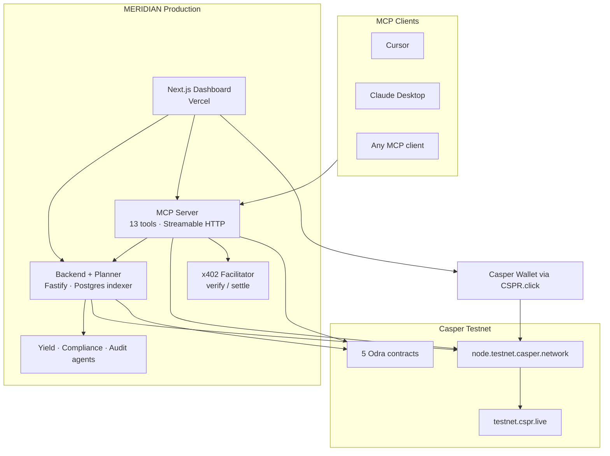
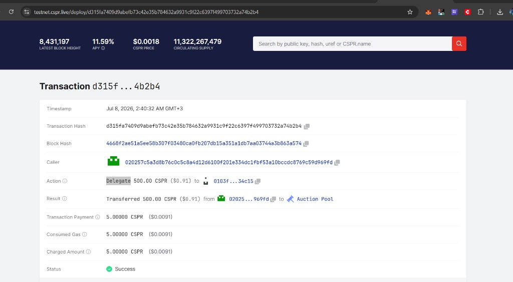
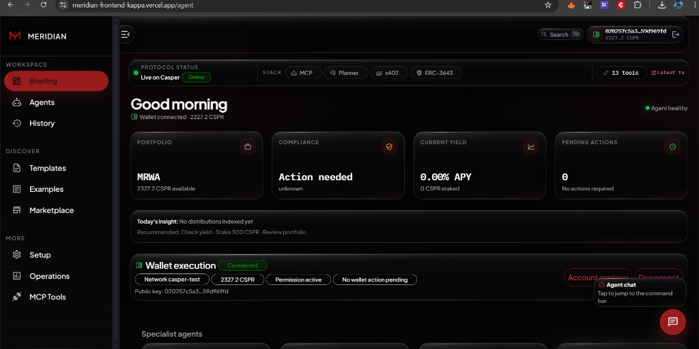

<p align="center">
  
</p>

<h1 align="center">MERIDIAN</h1>

<p align="center">
  <strong>Agent-first Casper RWA protocol — MCP tools, wallet-signed writes, ERC-3643 compliance, and native yield.</strong>
</p>

<p align="center">
  <em>Claude, Cursor, and any MCP client are the product. The dashboard is the proof.</em>
</p>

<p align="center">
  <a href="https://meridian-frontend-kappa.vercel.app">Live Dashboard</a> ·
  <a href="https://meridian-mcp-server-94q4.onrender.com/health">MCP Health</a> ·
  <a href="https://testnet.cspr.live">Casper Explorer</a> ·
  <a href="https://github.com/mohamedwael201193/MERIDIAN">GitHub</a>
</p>

<p align="center">
  
  
  
  
  
  
</p>

---

## Status legend

Every claim in this document is classified. **Do not assume more than the label states.**

| Label                    | Meaning                                                         |
| ------------------------ | --------------------------------------------------------------- |
| ✅ **Live**              | Deployed and reachable on production URLs or Casper testnet     |
| ✅ **Working**           | Verified by live HTTP call, browser visit, or on-chain explorer |
| ✅ **Implemented**       | Source code exists in this repository                           |
| 🟡 **Planned — Phase 2** | Designed or stubbed; not production-complete                    |
| 🟡 **Blocked**           | Implemented but intentionally fails with documented reason      |

---

# Demo video

🟡 **Planned — Phase 2.** No demo video is committed to this repository (`demos/video/` does not exist). Use the [live dashboard](https://meridian-frontend-kappa.vercel.app/agent) and [explorer proofs](#real-on-chain-proof) below.

---

# Live demo

| Surface                   | URL                                                   | Status                      |
| ------------------------- | ----------------------------------------------------- | --------------------------- |
| Briefing (command center) | https://meridian-frontend-kappa.vercel.app/agent      | ✅ Live                     |
| Landing                   | https://meridian-frontend-kappa.vercel.app/           | ✅ Live                     |
| MCP server health         | https://meridian-mcp-server-94q4.onrender.com/health  | ✅ Working — 13 tools       |
| Backend health            | https://meridian-backend-ikx8.onrender.com/health     | ✅ Live — indexer lag noted |
| x402 facilitator          | https://meridian-x402-facilitator.onrender.com/health | ✅ Live                     |
| Casper testnet explorer   | https://testnet.cspr.live                             | ✅ Live                     |

**Verified 2026-07-08:** MCP health returns `status: ok`, `transport: http`, `tools: 13`. Backend returns `status: degraded` because `indexer_lag` reports ~98,090 blocks behind — Postgres, RPC, CSPR.cloud, and Upstash checks pass.

---

# Vision

MERIDIAN is an **agent-first operating system** for regulated real-world assets on Casper.

Humans and AI agents express objectives in natural language. A **planner** discovers the 13 MERIDIAN MCP tools, runs **read tools** against live indexer and RPC data, and only requests **wallet approval** when a write is required. Unsigned `TransactionV1` payloads are signed in **Casper Wallet** via **CSPR.click** — keys never leave the user.

The Next.js dashboard is a **visualizer**: briefing metrics, MCP explorer, agent traces, and transaction review cards. It is not a custodial product.

**Phase 2 vision (🟡):** on-chain agent registry, autonomous agent-to-agent x402 economy, mainnet deployment, gas abstraction, session keys, and a full agent marketplace with revenue share.

---

# The problem

Institutional RWAs need three things DeFi rarely delivers together:

1. **Compliance** — jurisdiction, accreditation, sanctions screening before transfer (ERC-3643-style logic).
2. **Yield** — auditable staking and distribution with on-chain attestations.
3. **Autonomous operations** — AI agents that read state, plan actions, and stop at human wallet approval.

Current pain points:

- Custom dApp APIs trap agents in one frontend; no standard tool discovery.
- Custodial agent wallets violate institutional policy.
- EVM-first RWA stacks lack Casper’s native delegation, auction, and CEP-88 event model.
- Micropayment-gated premium data (audits, analytics) has no standard until **x402**.

---

# Why Casper

✅ **Implemented and deployed on `casper-test`:**

| Capability                          | MERIDIAN usage                                               |
| ----------------------------------- | ------------------------------------------------------------ |
| Native delegation                   | `delegate_stake` MCP tool — min **500 CSPR** (protocol rule) |
| Contract packages (Odra)            | 5 deployed packages with wired cross-contract addresses      |
| CEP-18 + custom compliance          | `MeridianToken` + `ComplianceRegistry`                       |
| CEP-88 events                       | Indexer → Postgres → MCP read tools                          |
| CSPR.cloud x402 facilitator pattern | Native CSPR micropayments for `subscribe_audit`              |
| Auction validators                  | `list_validators` reads live RPC                             |

**Why not trivially portable:** MERIDIAN’s `StakingVault.deposit()` requires Odra **payable `__cargo_purse`** wiring; `distribute_rewards` requires **YieldDistributor** as caller — constraints rooted in Casper/Odra execution model (see [blocked write tools](#write-tools-status)).

---

# Architecture



---

# System overview

| Layer          | Responsibility                                       | Status                        |
| -------------- | ---------------------------------------------------- | ----------------------------- |
| **MCP server** | Tool discovery, read execution, unsigned tx build    | ✅ Live                       |
| **Backend**    | Indexer, REST API, planner, agent runner, SSE traces | ✅ Live                       |
| **Planner**    | Objective → tool plan → invoke reads/writes          | ✅ Implemented                |
| **Frontend**   | Briefing, MCP UI, wallet flows, templates            | ✅ Live                       |
| **x402**       | Premium audit payment verify/settle                  | ✅ Live                       |
| **Contracts**  | MRWA, compliance, vault, yield, audit                | ✅ Live testnet               |
| **Agents**     | Yield, compliance, audit decision loops              | ✅ Implemented — backend cron |

---

# Dashboard routes (verified in browser + source)

Routes come from `frontend/src/app/**/page.tsx` and `frontend/src/nickelfox/data/nav-items.ts`. **Nav labels ≠ URL paths** in several cases.

| URL            | Nav label      | Purpose                                               | Status                                    |
| -------------- | -------------- | ----------------------------------------------------- | ----------------------------------------- |
| `/`            | —              | Landing, live KPIs from backend                       | ✅ Working                                |
| `/agent`       | **Briefing**   | Command center, planner pipeline, wallet execution    | ✅ Working                                |
| `/agents`      | Agents         | Agent Activity Center, trace timeline                 | ✅ Implemented                            |
| `/activity`    | **History**    | Indexed events and trace stream                       | ✅ Implemented                            |
| `/templates`   | Templates      | Pre-built mission objectives                          | ✅ Implemented                            |
| `/examples`    | Examples       | 111-prompt library (`frontend/lib/prompt-library.ts`) | ✅ Implemented                            |
| `/marketplace` | Marketplace    | 5 installable agent templates (local profile)         | ✅ Implemented — not on-chain marketplace |
| `/start`       | **Setup**      | MCP + wallet onboarding wizard                        | ✅ Implemented                            |
| `/dashboard`   | **Operations** | Protocol KPIs, treasury-style overview                | ✅ Implemented                            |
| `/mcp`         | MCP Tools      | Search, invoke reads, build writes                    | ✅ Working                                |
| `/issue`       | Tokens         | MRWA package info; mint blocked honestly              | ✅ Implemented                            |
| `/staking`     | —              | Staking vault + delegation panels                     | ✅ Implemented                            |
| `/compliance`  | —              | Holder registry UI                                    | ✅ Implemented                            |
| `/audit`       | —              | Audit summaries                                       | ✅ Implemented                            |
| `/x402`        | —              | x402 payment demonstration                            | ✅ Implemented                            |

**Redirects** (`frontend/next.config.mjs`):

| Source                | Destination                         |
| --------------------- | ----------------------------------- |
| `/playground`         | `/agent`                            |
| `/prompts`            | `/examples`                         |
| `/missions`           | `/templates`                        |
| `/dashboard/agents`   | `/agents`                           |
| `/dashboard/agent`    | `/agent`                            |
| `/dashboard/activity` | `/activity`                         |
| `/dashboard/start`    | `/start`                            |
| Other `/dashboard/*`  | Flat routes (`/staking`, `/mcp`, …) |

**Does not exist as a URL:** `/operations`, `/setup`, `/history` — use `/dashboard`, `/start`, `/activity` instead.

---

# Real on-chain proof

## Delegate 500 CSPR — wallet-signed, finalized on testnet

| Field           | Value                                                                                                                                                                   |
| --------------- | ----------------------------------------------------------------------------------------------------------------------------------------------------------------------- |
| **Transaction** | [`d315fa7409d9abefb73c42e35b784632a9931c9f22c6397f499703732a74b2b4`](https://testnet.cspr.live/deploy/d315fa7409d9abefb73c42e35b784632a9931c9f22c6397f499703732a74b2b4) |
| **Action**      | Native Casper **Delegate**                                                                                                                                              |
| **Amount**      | 500.00 CSPR → auction pool                                                                                                                                              |
| **Status**      | ✅ Success                                                                                                                                                              |
| **Timestamp**   | 2026-07-08 ~02:40 GMT+3                                                                                                                                                 |
| **Caller**      | `020257c5a3d8b76c0c5c8a4d12d6100f201e334dc1fbf53a10bccdc8769c59d969fd`                                                                                                  |
| **Gas**         | 5 CSPR                                                                                                                                                                  |

**What happened:**

1. MERIDIAN MCP `delegate_stake` built an unsigned `TransactionV1` (min 500 CSPR enforced in `mcp-server/src/casper/tx-builder.ts`).
2. User connected **Casper Wallet** via CSPR.click on the Briefing page.
3. User signed in the wallet extension — non-custodial; MCP never held keys.
4. Transaction broadcast to `https://node.testnet.casper.network/rpc`.
5. Finality confirmed on [CSPR.live](https://testnet.cspr.live/deploy/d315fa7409d9abefb73c42e35b784632a9931c9f22c6397f499703732a74b2b4).

<p align="center">
  
</p>

## Contract deploy transactions

From `deployed/addresses.json`:

| Label                     | Hash                                                               | Explorer                                                                                                  |
| ------------------------- | ------------------------------------------------------------------ | --------------------------------------------------------------------------------------------------------- |
| deploy_ComplianceRegistry | `930efed7e6e20e36b4f3a4d03bbe0a5952160f277c9c14387659da5a311b1bd8` | [View](https://testnet.cspr.live/deploy/930efed7e6e20e36b4f3a4d03bbe0a5952160f277c9c14387659da5a311b1bd8) |
| deploy_MeridianToken      | `ca4c4b96e6cf5638633b3123d5e54397b611256d656eea19938b5eb4493fcc74` | [View](https://testnet.cspr.live/deploy/ca4c4b96e6cf5638633b3123d5e54397b611256d656eea19938b5eb4493fcc74) |
| deploy_StakingVault       | `e69eb51cfe1fad92c581f953284266abb9fced6fb29e3d40e55de487338b0326` | [View](https://testnet.cspr.live/deploy/e69eb51cfe1fad92c581f953284266abb9fced6fb29e3d40e55de487338b0326) |
| deploy_YieldDistributor   | `2c3ca30dd90156bdd303837e16f152cfacf3fad531249f4e8030bab8deadc6e8` | [View](https://testnet.cspr.live/deploy/2c3ca30dd90156bdd303837e16f152cfacf3fad531249f4e8030bab8deadc6e8) |
| deploy_MeridianAudit      | `1611925b3bf87df18855cac35dc42b9ecab695176cc49a6c4de8c9375034f08f` | [View](https://testnet.cspr.live/deploy/1611925b3bf87df18855cac35dc42b9ecab695176cc49a6c4de8c9375034f08f) |

---

# Smart contracts

**Network:** `casper-test` · **Deployed:** 2026-06-28 · **Source:** `contracts/meridian-contracts/src/`

---

## ComplianceRegistry

|                  |                                                                                                                                                                                    |
| ---------------- | ---------------------------------------------------------------------------------------------------------------------------------------------------------------------------------- |
| **Purpose**      | ERC-3643-style holder registry — attestation, jurisdiction, sanctions flags, revoke/reinstate                                                                                      |
| **Package**      | `contract-package-e6ed2d2eb8a1ffc7aa55a4158643a3682493d6f15f1e7123113a9c8534ee84f8`                                                                                                |
| **Contract**     | `hash-e6ed2d2eb8a1ffc7aa55a4158643a3682493d6f15f1e7123113a9c8534ee84f8`                                                                                                            |
| **Explorer**     | [testnet.cspr.live](https://testnet.cspr.live/contract/hash-e6ed2d2eb8a1ffc7aa55a4158643a3682493d6f15f1e7123113a9c8534ee84f8)                                                      |
| **Entry points** | `init`, `register_holder`, `revoke`, `reinstate`, `is_compliant`, `get_attestation`, `get_rules`, `update_rules`, `set_compliance_officer`, `set_token_address`, timelock upgrades |
| **Used by**      | `MeridianToken` (transfer gate), MCP `get_compliance_status`, `register_holder`, `revoke_holder`                                                                                   |
| **Dependencies** | Wired to MeridianToken address on deploy                                                                                                                                           |

---

## MeridianToken (MRWA)

|                  |                                                                                                                                          |
| ---------------- | ---------------------------------------------------------------------------------------------------------------------------------------- |
| **Purpose**      | CEP-18 compliant RWA token with transfer restrictions and yield accrual hooks                                                            |
| **Package**      | `contract-package-9bcac97d0e6723049fc130daa22f69e88a5d077a1df6b4e38536f0703bcaa2ca`                                                      |
| **Contract**     | `hash-9bcac97d0e6723049fc130daa22f69e88a5d077a1df6b4e38536f0703bcaa2ca`                                                                  |
| **Explorer**     | [testnet.cspr.live](https://testnet.cspr.live/contract/hash-9bcac97d0e6723049fc130daa22f69e88a5d077a1df6b4e38536f0703bcaa2ca)            |
| **Symbol**       | `MRWA` (verified via backend indexer)                                                                                                    |
| **Entry points** | `init`, `transfer`, `transfer_from`, `accrue_yield`, `revoke_holder`, `reinstate_holder`, `set_staking_vault`, `set_compliance_registry` |
| **Used by**      | MCP `get_token_info`, `transfer_token`; all vault flows                                                                                  |
| **Dependencies** | `ComplianceRegistry`, optional `StakingVault`                                                                                            |

---

## StakingVault

|                  |                                                                                                                                                                     |
| ---------------- | ------------------------------------------------------------------------------------------------------------------------------------------------------------------- |
| **Purpose**      | Custody of staked CSPR/MRWA, validator delegation, reward distribution trigger                                                                                      |
| **Package**      | `contract-package-3062ba32a4ef4d3fd0fc5c9d0895980b7bbbcc5f407590d1b14c60ca631300c7`                                                                                 |
| **Contract**     | `hash-3062ba32a4ef4d3fd0fc5c9d0895980b7bbbcc5f407590d1b14c60ca631300c7`                                                                                             |
| **Explorer**     | [testnet.cspr.live](https://testnet.cspr.live/contract/hash-3062ba32a4ef4d3fd0fc5c9d0895980b7bbbcc5f407590d1b14c60ca631300c7)                                       |
| **Entry points** | `init`, `deposit` (payable), `restake`, `undelegate`, `claim_rewards`, `distribute_rewards`, `forward_distribute`, `set_yield_distributor`, `set_validator_curator` |
| **Used by**      | MCP `deposit_to_vault` (blocked), `restake`, `distribute_rewards` (blocked)                                                                                         |
| **Dependencies** | `MeridianToken`, `YieldDistributor` as authorized caller                                                                                                            |

---

## YieldDistributor

|                  |                                                                                                                               |
| ---------------- | ----------------------------------------------------------------------------------------------------------------------------- |
| **Purpose**      | Era-based reward splitting, holder registration, protocol fee                                                                 |
| **Package**      | `contract-package-378bf2fddb1e574f39014bff6280f101c264da6fc4c629ad4e8c0d8ce55a6c34`                                           |
| **Contract**     | `hash-378bf2fddb1e574f39014bff6280f101c264da6fc4c629ad4e8c0d8ce55a6c34`                                                       |
| **Explorer**     | [testnet.cspr.live](https://testnet.cspr.live/contract/hash-378bf2fddb1e574f39014bff6280f101c264da6fc4c629ad4e8c0d8ce55a6c34) |
| **Entry points** | `init`, `register_holder`, `distribute`, `pending_yield`, `set_protocol_fee_bps`                                              |
| **Used by**      | Vault `distribute_rewards` path — **must be contract caller**, not user wallet                                                |
| **Dependencies** | `StakingVault`, `MeridianToken`                                                                                               |

---

## MeridianAudit

|                  |                                                                                                                               |
| ---------------- | ----------------------------------------------------------------------------------------------------------------------------- |
| **Purpose**      | On-chain audit summary attestations (CEP-88 style trail)                                                                      |
| **Package**      | `contract-package-1d8bc0bbbb6dda232afcff2afa257e7572d1ac33c518b1852b9a34c707493d84`                                           |
| **Contract**     | `hash-1d8bc0bbbb6dda232afcff2afa257e7572d1ac33c518b1852b9a34c707493d84`                                                       |
| **Explorer**     | [testnet.cspr.live](https://testnet.cspr.live/contract/hash-1d8bc0bbbb6dda232afcff2afa257e7572d1ac33c518b1852b9a34c707493d84) |
| **Entry points** | `init`, `submit_summary`, `get_summary`, `get_latest_summaries`, `set_audit_signer`                                           |
| **Used by**      | Audit agent, MCP `subscribe_audit`, backend `/api/v1/audit/summaries`                                                         |
| **Dependencies** | Independent; fed by indexer events                                                                                            |

---

# MCP architecture

## Why MCP (not a custom REST API for agents)

✅ **Implemented design decision:**

- **Tool discovery** — agents list 13 typed tools with JSON Schema args.
- **Client portability** — same server works in Cursor, Claude Desktop, Claude Code, and any MCP-compatible runtime.
- **Read/write separation** — schema and descriptions encode wallet requirements.
- **Honest failures** — blocked tools return explicit errors, not silent mocks.

MERIDIAN still exposes a REST backend for the dashboard and indexer; MCP is the **agent contract surface**.

## Production MERIDIAN MCP

|               |                                                                                                                            |
| ------------- | -------------------------------------------------------------------------------------------------------------------------- |
| **URL**       | `https://meridian-mcp-server-94q4.onrender.com/mcp`                                                                        |
| **Health**    | `GET /health` → `{ status, transport, tools, toolNames }`                                                                  |
| **Transport** | **Streamable HTTP** (production); **stdio** available for local dev (`MERIDIAN_MCP_TRANSPORT=stdio`)                       |
| **Auth**      | Backend proxy uses `MERIDIAN_API_KEY`; public MCP health is unauthenticated; write tools require `callerPublicKey` in args |

### Session handshake (verified)

Streamable HTTP requires `initialize` → `notifications/initialized` → `tools/call` with `mcp-session-id` header from the initialize response. This is why bare POSTs without a session return `Server not initialized`.

## Other MCP servers (developer environment)

These are **not part of MERIDIAN protocol code** but appear in Cursor IDE for development:

| Server                   | Role                                            |
| ------------------------ | ----------------------------------------------- |
| **cursor-ide-browser**   | Navigate and verify production dashboard routes |
| **user-chrome-devtools** | CDP inspection, performance                     |
| **user-firecrawl**       | Web research and documentation scrape           |
| **user-playwright**      | E2E browser automation                          |

MERIDIAN is the **only** MCP server that executes Casper RWA operations.

## Connect Cursor

Copy `config/cursor/mcp.json`:

```json
{
  "mcpServers": {
    "meridian": {
      "url": "https://meridian-mcp-server-94q4.onrender.com/mcp"
    }
  }
}
```

Reload Cursor → **Settings → MCP** → confirm `meridian` connected. See `docs/cursor-integration.md`.

## Connect Claude Desktop

See `config/claude/README.md` and `docs/claude-integration.md`. Production uses Streamable HTTP URL; local dev can use stdio via `pnpm --filter @meridian/mcp-server start:stdio`.

## Connect any MCP client

1. Point at `https://meridian-mcp-server-94q4.onrender.com/mcp`.
2. Complete MCP initialize handshake.
3. Call tools by name with JSON arguments.
4. For writes, pass `callerPublicKey` from the user’s Casper wallet.
5. Sign returned `unsignedTransaction` locally.

Install the agent skill: `frontend/public/meridian-skill.md` or `skills/MERIDIAN/SKILL.md`.

---

# MCP tools — live verification

**Verified 2026-07-08** via Streamable HTTP session against production MCP.

## Read tools

### `get_token_info` — ✅ Working

Returns `deployed` object mirroring `deployed/addresses.json` plus indexed MRWA metadata from backend. No wallet required.

### `get_yield_rate` — ✅ Working

Live response (indexer):

```json
{
  "packageHash": "contract-package-9bcac97d0e6723049fc130daa22f69e88a5d077a1df6b4e38536f0703bcaa2ca",
  "contractName": "MeridianToken",
  "totalStaked": "0",
  "totalSupply": "0",
  "recentEras": 0,
  "estimatedApyBps": 0,
  "lastDistribution": null
}
```

`estimatedApyBps: 0` is **honest** — no on-chain distribution indexed yet; not a mock.

### `list_validators` — ✅ Working

Live RPC sample:

```json
{
  "validators": [
    {
      "public_key": "0103fb826facdd9354dd381a27805a508133b318cb2715a2132afd740999434c15",
      "stake": "5001653649845"
    },
    {
      "public_key": "0106ca7c39cd272dbf21a86eeb3b36b7c26e2e9b94af64292419f7862936bca2ca",
      "stake": "44688279412123090"
    }
  ],
  "network": "casper-test"
}
```

### `get_holder_yield` — ✅ Implemented

Reads distribution history from backend `/api/v1/yields/history`.

### `get_compliance_status` — ✅ Implemented

Reads `ComplianceRegistry` mirror from Postgres by account hash.

### `subscribe_audit` — ✅ Working (x402 gated)

Without `paymentHeader`: returns `PAYMENT_REQUIRED` / 402 with facilitator URL. With valid x402 payment: returns audit summaries and indexed events.

## Write tools

| Tool                 | Status         | What it does                                                                                                              |
| -------------------- | -------------- | ------------------------------------------------------------------------------------------------------------------------- |
| `transfer_token`     | ✅ Working     | Unsigned MRWA `transfer` — wallet signs                                                                                   |
| `register_holder`    | ✅ Working     | Unsigned `ComplianceRegistry.register_holder` — CONTRACT_OWNER                                                            |
| `revoke_holder`      | ✅ Working     | Unsigned `revoke` — COMPLIANCE_OFFICER                                                                                    |
| `delegate_stake`     | ✅ Working     | Unsigned native delegation — **min 500 CSPR** — [proven on-chain](#delegate-500-cspr--wallet-signed-finalized-on-testnet) |
| `restake`            | ✅ Implemented | Vault validator migration — VALIDATOR_CURATOR role                                                                        |
| `deposit_to_vault`   | 🟡 **Blocked** | See below                                                                                                                 |
| `distribute_rewards` | 🟡 **Blocked** | See below                                                                                                                 |

### Write tools status

**`deposit_to_vault` — 🟡 Blocked**

```
deposit_to_vault requires Odra payable cargo purse wiring (__cargo_purse).
Browser wallet TransactionV1 builder does not attach that value yet,
so no unsigned deploy was created.
```

Source: `mcp-server/src/casper/tx-builder.ts`

**`distribute_rewards` — 🟡 Blocked**

```
distribute_rewards cannot be signed by a user wallet.
StakingVault requires the YieldDistributor contract as caller,
so no unsigned deploy was created.
```

Source: `mcp-server/src/casper/tx-builder.ts` — requires Phase 2 agent contract caller path.

### Write flow (all working write tools)

1. MCP returns `unsignedTransaction` (TransactionV1 JSON).
2. Dashboard or client shows **Transaction Review** card.
3. CSPR.click opens Casper Wallet.
4. User signs — **non-custodial**.
5. Client broadcasts to Casper RPC.
6. UI polls `/api/transactions/status/[hash]` until finality.
7. Explorer link: `https://testnet.cspr.live/deploy/{hash}`.

---

# Planner

✅ **Implemented** — `backend/src/planner/planner-service.ts`

The planner is **rule-based** (regex keyword matching), not an LLM planner:

1. Receives `objective` via `POST /api/v1/planner/execute`.
2. Emits traces to `meridian_agent_traces` (SSE via `/api/v1/traces/stream`).
3. `buildPlan()` maps keywords → ordered tool steps (yield, audit, delegate, compliance, …).
4. Executes read tools inline against backend + RPC.
5. Write tools → `invokeWriteTool()` → `TransactionBuilder` in MCP package.
6. Returns `{ sessionId, reasoning, steps[] }` with `walletRequired: true` for writes.

**Guards:**

- `callerPublicKey` required for write intents.
- `issue`/`mint` objectives throw — token already deployed.
- Min delegation `500_000_000_000` motes enforced.

Frontend proxy: `frontend/src/app/api/planner/execute/route.ts` → production backend.

---

# Agent skills

## MERIDIAN skill (official)

✅ **Implemented** — `skills/MERIDIAN/SKILL.md`, `frontend/public/meridian-skill.md`

Teaches agents: read-before-write, 13-tool catalog, x402 flow, 500 CSPR minimum, explorer links, human approval checkpoints.

## Marketplace templates

✅ **Implemented** — `frontend/lib/agent-marketplace.ts` (UI templates, local storage)

| Template             | Focus                                                    |
| -------------------- | -------------------------------------------------------- |
| **Treasury Agent**   | Capital allocation; vault ops (deposit blocked honestly) |
| **Compliance Agent** | Registry, sanctions, register/revoke                     |
| **Yield Agent**      | APY, delegation, distribution history                    |
| **Portfolio Agent**  | Read-only aggregation                                    |
| **Audit Agent**      | Premium `subscribe_audit` + x402                         |

🟡 **Phase 2:** on-chain agent registry, installable third-party skills, revenue share.

## Backend agents (autonomous loops)

✅ **Implemented** — `agents/yield-agent`, `agents/compliance-agent`, `agents/audit-agent`

Run when `AGENTS_ENABLED=true` on Render (`render.yaml`). Each agent:

- Reads live backend state.
- Calls LLM with structured JSON schema (`@meridian/agents-shared`).
- Posts decisions to `/api/v1/decisions`.
- Uses Redis coordination for rate limits and human review gates.
- **Does not auto-sign** — pending review until operator approves.

## Prompt library

✅ **Implemented** — **111 prompts** in `frontend/lib/prompt-library.ts` across 12 categories (General, Compliance, Yield, Staking, Vault, Payments, Audit, Transfer, Portfolio, Developer, Planner, Judge Demo).

## Policy engine & approval rules

✅ **Implemented** in:

- Marketplace template `policies[]` arrays.
- `skills/MERIDIAN/SKILL.md` tool ordering rules.
- Planner traces `wallet_required` events.
- Agent `AgentCoordination.isReviewApproved()` gate.

## Memory

✅ **Implemented** — template `memorySeeds` → `updateAgentProfile()` local storage; agent decisions persisted in `meridian_agent_decisions` Postgres table.

---

# AI flow

```
User objective (natural language)
        ↓
Planner buildPlan() — keyword → tool steps
        ↓
Read tools (MCP / backend / RPC) — cite real fields
        ↓
Write needed? → unsigned TransactionV1
        ↓
wallet_required trace + Transaction Review card
        ↓
User signs in Casper Wallet (CSPR.click)
        ↓
Broadcast → RPC → Explorer finality
```

LLM usage: backend agents and playground chat — **not** for core planner routing in Phase 1.

---

# Wallet flow

✅ **Implemented**

| Step       | Component                                      |
| ---------- | ---------------------------------------------- |
| Connect    | CSPR.click (`NEXT_PUBLIC_CSPRCLICK_APP_ID`)    |
| Network    | `casper-test`                                  |
| Public key | Passed to MCP write tools as `callerPublicKey` |
| Review     | `TransactionReviewCard` — compact approval UI  |
| Sign       | Casper Wallet extension                        |
| Track      | SSE traces + transaction status API            |

Keys never pass through MCP server or backend.

---

# Compliance (ERC-3643-style)

✅ **Live on testnet**

- `ComplianceRegistry` enforces attestation, jurisdiction, accreditation, sanctions flags.
- `MeridianToken.transfer` checks `is_compliant` and not revoked.
- MCP: `get_compliance_status` (read), `register_holder`, `revoke_holder` (writes).
- Backend indexes holder state to Postgres.

🟡 **Phase 2:** live OFAC/EU feed automation in ComplianceAgent (feeds configured in env; full pipeline expansion planned).

---

# Yield

✅ **Implemented**

- Native delegation via `delegate_stake` — **proven** with 500 CSPR tx.
- Vault staking via `deposit_to_vault` — 🟡 blocked pending payable wiring.
- Era distribution via `distribute_rewards` — 🟡 blocked pending YieldDistributor caller path.
- `get_yield_rate`, `get_holder_yield` read indexed state.

Current indexer shows `totalStaked: 0`, `estimatedApyBps: 0` — honest empty state until vault deposits and distributions occur on-chain.

---

# x402

✅ **Live** — `https://meridian-x402-facilitator.onrender.com`

| Resource                                                                                 | Payment                |
| ---------------------------------------------------------------------------------------- | ---------------------- |
| MCP read tools (except audit)                                                            | **Free**               |
| `subscribe_audit` without header                                                         | **Premium** — HTTP 402 |
| Resource server `/api/yield-rate`, `/api/validator-performance`, `/api/sanctions-merkle` | **Premium**            |

**Flow:**

1. Client calls gated endpoint → 402 + payment instructions.
2. Wallet pays CSPR per `X402_PAYMENT_AMOUNT_MOTES` (default **2.5 CSPR**).
3. Facilitator `POST /verify` → `POST /settle` on testnet.
4. Client retries with `paymentHeader` / `X-Payment`.

🟡 **Phase 2:** agent-to-agent autonomous x402 treasury, production mainnet facilitator, dynamic pricing.

## x402 settlement proof

✅ **Working** — verified in Phase 8.5 (`docs/reports/x402_100_settlement_results.json`, local report not on GitHub)

| Field             | Value                                                                                                                                                                   |
| ----------------- | ----------------------------------------------------------------------------------------------------------------------------------------------------------------------- |
| **Settlement tx** | [`2cb15743a401711c10a253da93dd0f8b9e2f3a186221f6c8d8fe9727933d9a9e`](https://testnet.cspr.live/deploy/2cb15743a401711c10a253da93dd0f8b9e2f3a186221f6c8d8fe9727933d9a9e) |
| **Amount**        | 2.5 CSPR (`2500000000` motes)                                                                                                                                           |
| **Purpose**       | `subscribe_audit` premium gate via MCP                                                                                                                                  |

---

# Marketplace

✅ **Implemented (UI)** — `/marketplace`

- 5 agent templates with install → local profile → run objective on `/agent`.
- **Not** an on-chain NFT/skill marketplace yet.

🟡 **Phase 2:** third-party agent publishing, x402 revenue share, reputation scores.

---

# Screenshots

<p align="center">
  
</p>

**Briefing (`/agent`)** — verified 2026-07-08: protocol status ribbon (MCP · Planner · x402 · ERC-3643), wallet `020257c5…` with live balance, compliance/yield cards, wallet execution panel.

---

# Technical stack

| Layer     | Technology                                               |
| --------- | -------------------------------------------------------- |
| Contracts | Rust, Odra 2.8.2, Casper `casper-test`                   |
| MCP       | TypeScript, `@modelcontextprotocol/sdk`, Streamable HTTP |
| Backend   | Fastify, PostgreSQL (Supabase), Upstash Redis            |
| Indexer   | CSPR.cloud streaming → Postgres                          |
| Frontend  | Next.js 14 App Router, MUI, Tailwind v4 tokens           |
| Wallet    | CSPR.click + Casper Wallet                               |
| x402      | `@meridian/casper-sdk`, CSPR.cloud facilitator pattern   |
| Agents    | Multi-provider LLM chain (`@meridian/agents-shared`)     |
| Deploy    | Vercel (frontend), Render (backend, MCP, x402)           |

---

# Repository structure

```
MERIDIAN/
├── contracts/meridian-contracts/   # Odra smart contracts (5 deployed)
├── mcp-server/                     # 13 MCP tools, tx-builder
├── backend/                        # API, indexer, planner, agents runner
├── frontend/                       # Next.js dashboard
├── x402-facilitator/               # verify / settle / resource server
├── agents/                         # yield, compliance, audit agents
├── packages/
│   ├── meridian-casper-sdk/        # Casper RPC, x402 helpers
│   ├── meridian-env/               # Zod env validation
│   └── casper-sdk/                 # TransactionV1 builder
├── deployed/addresses.json         # Testnet contract addresses
├── skills/MERIDIAN/SKILL.md        # Official agent skill
├── config/cursor/mcp.json          # Cursor MCP config
└── render.yaml                     # Render deployment manifest
```

---

# Deployment

| Service   | Platform                     | URL                                            |
| --------- | ---------------------------- | ---------------------------------------------- |
| Frontend  | Vercel                       | https://meridian-frontend-kappa.vercel.app     |
| Backend   | Render `meridian-backend`    | https://meridian-backend-ikx8.onrender.com     |
| MCP       | Render `meridian-mcp-server` | https://meridian-mcp-server-94q4.onrender.com  |
| x402      | Render `meridian-x402`       | https://meridian-x402-facilitator.onrender.com |
| Contracts | Casper testnet               | `deployed/addresses.json`                      |

---

# Environment

Copy `.env.example` and fill from `docs/ENVIRONMENT_REQUIREMENTS.md` (local copy — not on GitHub).

**Minimum for local run:**

- `DATABASE_URL`, `CASPER_RPC_URL`, `CASPER_CHAIN_NAME=casper-test`
- `MERIDIAN_API_KEY`, `BACKEND_URL`
- `UPSTASH_REDIS_REST_URL`, `UPSTASH_REDIS_REST_TOKEN`
- Frontend: `NEXT_PUBLIC_BACKEND_URL`, `NEXT_PUBLIC_MCP_SERVER_URL`, `NEXT_PUBLIC_CSPRCLICK_APP_ID`

**Never commit** `.env`, PEM keys, or API secrets.

---

# How to run

```bash
git clone https://github.com/mohamedwael201193/MERIDIAN.git
cd MERIDIAN
pnpm install
pnpm --filter @meridian/casper-sdk build
pnpm --filter @meridian/mcp-server build
pnpm --filter @meridian/backend run migrate
pnpm --filter @meridian/backend start
# separate terminal:
pnpm --filter @meridian/frontend dev
```

```bash
pnpm test
```

---

# Phase 2 roadmap

🟡 **Planned — not shipped**

| Item                              | Notes                                               |
| --------------------------------- | --------------------------------------------------- |
| `deposit_to_vault` payable wiring | Odra `__cargo_purse` in TransactionV1 builder       |
| `distribute_rewards` agent path   | YieldDistributor as contract caller                 |
| Mainnet deployment                | Testnet-complete; gates remain                      |
| Demo video                        | `demos/video/meridian-demo.mp4`                     |
| On-chain agent marketplace        | UI exists; chain registry does not                  |
| Agent-to-agent x402 economy       | Facilitator live; autonomous loops planned          |
| Gas abstraction / session keys    | Not implemented                                     |
| Multi-asset support               | MRWA only today                                     |
| Institutional onboarding KYC      | Compliance registry exists; enterprise flow planned |
| Developer SDK npm package         | Internal packages only                              |
| Indexer lag resolution            | Backend degraded until backfill completes           |

### Future startup vision (🟡)

| Revenue line             | Model                                                         |
| ------------------------ | ------------------------------------------------------------- |
| x402 premium feeds       | Per-query CSPR for audit, validator analytics, sanctions data |
| Institutional onboarding | Managed compliance registry + attestation API                 |
| Agent marketplace        | Revenue share on third-party MCP skills                       |
| Managed indexer          | SLA-backed CEP-88 mirror for RWA issuers                      |

Target customers: RWA issuers, Casper validators, AI agent platforms, compliance teams.

---

# Security

| Area              | Model                                                     |
| ----------------- | --------------------------------------------------------- |
| **Wallet**        | Non-custodial — CSPR.click / Casper Wallet only           |
| **MCP**           | No private keys on server; `callerPublicKey` in args only |
| **Backend**       | `X-API-Key` on `/api/v1/*`                                |
| **x402**          | Replay guard via Upstash Redis                            |
| **Contracts**     | Odra access control roles, timelock upgrades              |
| **Write honesty** | Blocked tools throw before wallet popup                   |

---

# Why MERIDIAN wins

- **Real AI surface** — 13 MCP tools on production HTTP, not a slide deck.
- **Real wallet path** — [500 CSPR delegate](https://testnet.cspr.live/deploy/d315fa7409d9abefb73c42e35b784632a9931c9f22c6397f499703732a74b2b4) finalized on testnet.
- **Real contracts** — 5 Odra packages wired and explorer-verified.
- **Honest execution** — blocked tools documented with source-level reasons.
- **Casper-native** — delegation, auction validators, CEP-88, CSPR x402.
- **Institutional framing** — ERC-3643-style compliance, audit trail, approval gates.

---

# Judge demo prompts

Copy into Cursor or Claude with MERIDIAN MCP connected:

| #   | Prompt                                                       | Expected result                            |
| --- | ------------------------------------------------------------ | ------------------------------------------ |
| 1   | `Use MERIDIAN MCP get_token_info`                            | Deployed contract map + MRWA metadata      |
| 2   | `Use MERIDIAN MCP get_yield_rate`                            | APY bps, staked — may be 0 honestly        |
| 3   | `Use MERIDIAN MCP list_validators limit 5`                   | Live auction validators                    |
| 4   | `Use MERIDIAN MCP get_compliance_status for my account hash` | Registry status from indexer               |
| 5   | `Use MERIDIAN MCP subscribe_audit`                           | 402 payment required                       |
| 6   | `Use MERIDIAN MCP delegate_stake 500 CSPR`                   | Unsigned TransactionV1                     |
| 7   | `Use MERIDIAN MCP deposit_to_vault`                          | Honest block error — payable not wired     |
| 8   | Open `/agent`                                                | Briefing with status ribbon + wallet panel |
| 9   | Open `/mcp`                                                  | 13 tools, invoke read instantly            |
| 10  | Sign delegate tx                                             | Explorer finality link                     |

---

# Backend API (dashboard proxy)

✅ **Implemented** — all routes require `X-API-Key` except `/health`.

| Endpoint                                  | Method    | Purpose                       |
| ----------------------------------------- | --------- | ----------------------------- |
| `/health`                                 | GET       | Postgres, RPC, indexer checks |
| `/api/v1/tokens`                          | GET       | Indexed token registry        |
| `/api/v1/tokens/:packageHash/yield`       | GET       | APY and staked totals         |
| `/api/v1/holders/:accountHash/compliance` | GET       | Compliance mirror             |
| `/api/v1/yields/history`                  | GET       | Distribution history          |
| `/api/v1/events`                          | GET       | CEP-88 indexed events         |
| `/api/v1/audit/summaries`                 | GET       | Audit summaries               |
| `/api/v1/decisions`                       | GET, POST | Agent decisions               |
| `/api/v1/traces`                          | GET, POST | Agent traces                  |
| `/api/v1/traces/stream`                   | GET       | SSE live trace stream         |
| `/api/v1/planner/execute`                 | POST      | Objective → tool plan         |

Swagger UI: `https://meridian-backend-ikx8.onrender.com/docs` (when enabled).

---

# Database schema

✅ **Implemented** — PostgreSQL via Supabase (`backend/src/db/migrations/`)

| Table                      | Purpose                                |
| -------------------------- | -------------------------------------- |
| `meridian_tokens`          | MRWA supply, staked totals per package |
| `meridian_holders`         | ComplianceRegistry mirror              |
| `meridian_distributions`   | Yield era distributions                |
| `meridian_events`          | Raw CEP-88 events from CSPR.cloud      |
| `meridian_audit_summaries` | AuditAgent summary hashes              |
| `indexer_checkpoints`      | Indexer restart recovery               |
| `meridian_agent_decisions` | Yield / Compliance / Audit decisions   |
| `x402_payments`            | Settlement audit trail                 |
| `meridian_agent_traces`    | Planner and MCP workflow traces        |

MCP read tools **never** invent chain state — they read these tables and live RPC.

---

# MCP tool reference (complete)

| Tool                    | Kind  | Required args                                               | Role / notes                  |
| ----------------------- | ----- | ----------------------------------------------------------- | ----------------------------- |
| `get_token_info`        | read  | `packageHash?`                                              | Deployed addresses + supply   |
| `get_yield_rate`        | read  | `packageHash?`                                              | APY bps, staked CSPR          |
| `get_holder_yield`      | read  | `limit?`                                                    | Distribution history          |
| `get_compliance_status` | read  | `accountHash`                                               | Registry status               |
| `list_validators`       | read  | `limit?`                                                    | Live auction validators       |
| `subscribe_audit`       | read  | `limit?`, `paymentHeader?`                                  | Premium — x402 without header |
| `transfer_token`        | write | `callerPublicKey`, `recipientAccountHash`, `amount`         | MRWA transfer                 |
| `register_holder`       | write | `callerPublicKey`, `holderAccountHash`, `attestationBytes`  | CONTRACT_OWNER                |
| `revoke_holder`         | write | `callerPublicKey`, `holderAccountHash`, `reason`            | COMPLIANCE_OFFICER            |
| `delegate_stake`        | write | `callerPublicKey`, `validator`, `amount`                    | Min 500 CSPR                  |
| `deposit_to_vault`      | write | `callerPublicKey`, `amount`                                 | 🟡 Blocked — payable          |
| `restake`               | write | `callerPublicKey`, `fromValidator`, `toValidator`, `amount` | VALIDATOR_CURATOR             |
| `distribute_rewards`    | write | `callerPublicKey`, `eraId`                                  | 🟡 Blocked — contract caller  |

---

# Links

| Resource     | URL                                               |
| ------------ | ------------------------------------------------- |
| Repository   | https://github.com/mohamedwael201193/MERIDIAN     |
| Live app     | https://meridian-frontend-kappa.vercel.app        |
| MCP          | https://meridian-mcp-server-94q4.onrender.com/mcp |
| Explorer     | https://testnet.cspr.live                         |
| Cursor setup | `docs/cursor-integration.md`                      |
| Claude setup | `docs/claude-integration.md`                      |
| Agent skill  | `skills/MERIDIAN/SKILL.md`                        |

---

# License

Source code is published under **Apache 2.0** intent (see package metadata). A root `LICENSE` file is 🟡 not yet committed — add before mainnet release.

---

<p align="center">
  <strong>MERIDIAN</strong> — Casper testnet · MCP · Wallet · Chain · Evidence over adjectives.
</p>
