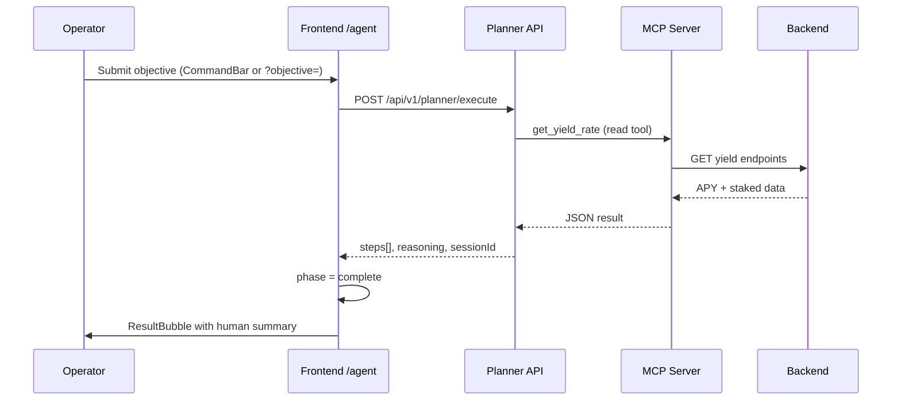
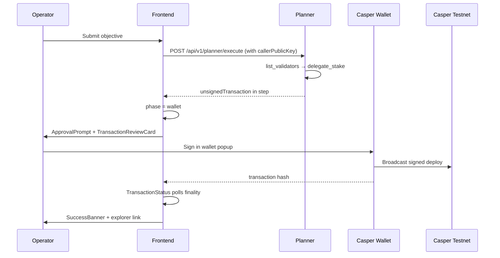

# MERIDIAN Agent Experience Specification

**Version:** 1.0  
**Date:** July 7, 2026  
**Primary surface:** `/agent` (`frontend/src/dashboard/pages/AgentHomePage.tsx`)  
**Runtime hook:** `frontend/lib/hooks/useAgentRuntime.ts`  
**Backend endpoint:** `POST /api/v1/planner/execute`

---

## Purpose

Define how operators interact with MERIDIAN agents: mission submission, planner execution, pipeline visibility, wallet approval, on-chain broadcast, and history. This spec covers the **web briefing runtime**. Direct MCP usage (Cursor/Claude) follows the same tool semantics but skips the web pipeline UI.

---

## Actors

| Actor             | Role                                                                      |
| ----------------- | ------------------------------------------------------------------------- |
| Operator          | Submits objectives, approves wallet transactions                          |
| Planner           | LLM-backed orchestrator selecting MCP read/write tools                    |
| MCP server        | Executes tool calls; write tools return unsigned txs                      |
| Casper Wallet     | Signs and broadcasts transactions (CSPR Click)                            |
| Indexer           | Reflects on-chain state for briefing KPIs                                 |
| Specialist agents | Static personas (yield, compliance, audit) launching templated objectives |

---

## Runtime Phases

Defined in `useAgentRuntime.ts` as `RuntimePhase`:

| Phase       | Meaning              | UI signal                                      |
| ----------- | -------------------- | ---------------------------------------------- |
| `idle`      | No active mission    | Briefing grid + suggestion chips               |
| `thinking`  | Planner invoked      | Pipeline stage: Planning                       |
| `selecting` | Tool selection       | Pipeline: Reading contracts                    |
| `calling`   | MCP tool invoked     | Pipeline: Building transaction                 |
| `analyzing` | Result processing    | Pipeline: Simulation                           |
| `wallet`    | Unsigned tx returned | `ApprovalPrompt` + Pipeline: Approval required |
| `waiting`   | User signing         | Pipeline: Approval active                      |
| `broadcast` | Tx submitted         | `TransactionStatus` polling                    |
| `finalized` | Finality observed    | Pipeline: Confirmed                            |
| `complete`  | Mission done         | `SuccessBanner`                                |
| `error`     | Failure              | Chat error bubble + pipeline error state       |

---

## Pipeline Stages (UI)

Canonical stage definitions: `PIPELINE_STAGES` in `frontend/src/design/tokens.ts`.

Rendered by `AgentPipeline` (`frontend/src/design/components/AgentPipeline.tsx`) on `/agent` when `runtime.phase !== 'idle'`.

| Stage ID     | Label                | Human copy                                              | Trace types                               |
| ------------ | -------------------- | ------------------------------------------------------- | ----------------------------------------- |
| `planning`   | Planning             | Analyzing your request and selecting the right approach | `objective_received`, `reasoning`         |
| `contracts`  | Reading contracts    | Loading on-chain contract state from the indexer        | `tool_discovery`, `tool_selected`         |
| `compliance` | Checking compliance  | Verifying ERC-3643 holder registry and sanctions status | —                                         |
| `wallet`     | Checking wallet      | Confirming wallet connection and account permissions    | `wallet_required`                         |
| `validators` | Finding validator    | Comparing Casper validators for optimal delegation      | —                                         |
| `building`   | Building transaction | Constructing the unsigned transaction payload           | `tool_invoked`                            |
| `simulation` | Simulation           | Validating amounts, targets, and expected outcomes      | —                                         |
| `approval`   | Approval required    | Waiting for your signature in Casper Wallet             | `wallet_signed`                           |
| `broadcast`  | Broadcast            | Submitting signed transaction to Casper testnet         | `deploy_broadcast`                        |
| `explorer`   | Explorer             | Transaction visible on testnet explorer                 | —                                         |
| `confirmed`  | Confirmed            | Finality reached and indexer will reflect state         | `finality`, `indexer_updated`, `complete` |

**Note:** `AgentExecutionConsole` (`frontend/src/components/AgentExecutionConsole.tsx`) implements a shorter stage list but is only mounted in orphan `AgentConsolePage.tsx`. **`AgentPipeline` is the canonical briefing component.**

---

## End-to-End Flow

### Read-only mission (no wallet)

Example: _"What is the current MRWA yield APY?"_



### Write mission (wallet approval required)

Example: _"Delegate 500 CSPR to the best validator"_



**Backend dependency:** Write path requires compiled `mcp-server/dist/casper/tx-builder.js` (see `docs/BUG_FIX_REPORT.md` BUG-001).

---

## Approval Flow

### Components

| Component               | Path                                                | Responsibility                 |
| ----------------------- | --------------------------------------------------- | ------------------------------ |
| `ApprovalPrompt`        | `frontend/src/components/agent/ApprovalPrompt.tsx`  | Wallet CTA with glow animation |
| `TransactionReviewCard` | `frontend/src/components/TransactionReviewCard.tsx` | Shows tool, amounts, targets   |
| `TransactionStatus`     | `frontend/src/components/TransactionStatus.tsx`     | Polls finality after broadcast |

### Approval copy (default)

- **Title:** "Your wallet approval is needed"
- **Description:** "Review the transaction below. Nothing happens until you approve in Casper Wallet."

### Approval rules

1. Unsigned tx must be parsed via `parseUnsignedTransaction()` before display
2. `signAndContinue()` calls `useWalletActions().signAndSubmit(unsignedTx)`
3. Traces emitted: `wallet_signed`, `deploy_broadcast`, `finality`, `indexer_updated`, `complete`
4. Mission recorded in agent profile via `recordMissionComplete()`

### Pending actions briefing rule

`BriefingGrid` pending count uses only:

- Active unsigned tx (`runtime.unsignedTx`)
- Runtime phases `wallet` or `waiting`

**Does not** count agent decision queue entries (`useDecisions`).

Source: `frontend/lib/hooks/useBriefingData.ts` lines 72–73.

---

## Planner Step Model

```typescript
interface PlannerStep {
  tool: string
  kind: 'read' | 'write'
  rationale: string
  result?: unknown
  unsignedTransaction?: unknown
  walletRequired: boolean
}
```

Human-readable summaries: `formatPlannerStep()` in `frontend/lib/human-results.ts`.

Write tool invocation on backend: `backend/src/planner/write-tool-invoker.ts` → `loadTxBuilder()` from `resolve-tx-builder.ts`.

---

## SSE Trace Stream

| Hook                  | Path                                        | Usage                                           |
| --------------------- | ------------------------------------------- | ----------------------------------------------- |
| `useAgentTraceStream` | `frontend/lib/hooks/useAgentTraceStream.ts` | Live traces on `/agent`, `/agents`, `/activity` |
| `emitTrace`           | Called from `useAgentRuntime`               | Client-side trace events post-wallet            |

Traces drive pipeline stage completion via `step_type` matching in `AgentPipeline.resolveStageStatus()`.

---

## Entry Points

| Entry                                     | Behavior                                |
| ----------------------------------------- | --------------------------------------- |
| CommandBar on `/agent`                    | Primary mission input                   |
| `?objective=` query param                 | Auto-run on mount (setup wizard step 6) |
| SuggestionChips                           | Pre-built read/write prompts            |
| AgentEmployeeCard                         | Specialist assign → `send(objective)`   |
| `/templates`, `/examples`, `/marketplace` | Router push to `/agent?objective=`      |
| Command Palette ⌘K                        | Navigate + quick actions                |

---

## Specialist Agents

Static definitions: `SPECIALIST_AGENTS` in `frontend/lib/starter-prompts.ts`.

Displayed on:

- `/agent` (top 3 cards when no conversation)
- `/agents` (full roster with status from decisions + traces)

Status logic:

- `attention` — pending decision with `approved === null`
- `active` — recent decision or trace match
- `idle` — default

---

## x402 Premium Path

Tool: `subscribe_audit` (read tool with payment gate).

When planner or MCP hits premium audit without payment:

1. Returns 402 hint
2. Operator pays via x402 facilitator (`/x402` page)
3. Retries with `paymentHeader`

Pipeline stage: surfaces under compliance/audit messaging.

---

## Error Handling

| Error                         | User experience                                    | Phase                  |
| ----------------------------- | -------------------------------------------------- | ---------------------- |
| Planner 422                   | Chat error bubble with message                     | `error`                |
| MODULE_NOT_FOUND (tx-builder) | Error bubble; write missions blocked               | `error`                |
| Wallet rejected               | Error bubble + trace `error`                       | `error`                |
| Backend degraded              | Read missions may succeed with stale data          | `complete` with caveat |
| MCP unreachable               | Setup wizard step 4 fails; ribbon "MCP connecting" | N/A                    |

---

## Profile and Memory

| Field              | Storage      | Purpose                               |
| ------------------ | ------------ | ------------------------------------- |
| `installedSkills`  | localStorage | Gates CommandBar until setup complete |
| `activeTemplateId` | localStorage | Marketplace template policies         |
| `memory`           | localStorage | Template memory seeds                 |
| `walletPublicKey`  | localStorage | Synced from wallet on connect         |

Loader: `frontend/lib/agent-profile.ts`.

---

## Gaps and Roadmap

| Gap                                        | Priority | Target                                     |
| ------------------------------------------ | -------- | ------------------------------------------ |
| Pre-sign simulation step in ApprovalPrompt | P1       | Show expected outcomes before wallet popup |
| Activity page pipeline replay              | P1       | Reuse `AgentPipeline` in read-only mode    |
| Orphan `AgentConsolePage`                  | P2       | Remove or redirect to `/agent`             |
| Degraded backend banner on briefing        | P1       | When `useHealth().status === 'degraded'`   |
| Agent decision approval UI                 | P2       | Separate from wallet pending count         |

---

## Related Documents

- `docs/ONBOARDING_FLOW.md` — first mission launch
- `docs/MCP_INTEGRATION_GUIDE.md` — direct MCP tool usage
- `docs/UX_REDESIGN_PLAN.md` — briefing layout spec
- `docs/BUG_FIX_REPORT.md` — planner write path fix
