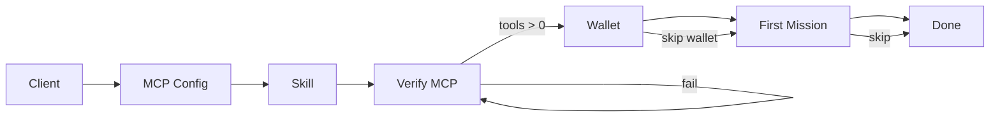

# MERIDIAN Onboarding Flow

**Version:** 1.0  
**Date:** July 7, 2026  
**Route:** `/start`  
**Implementation:** `frontend/src/design/components/SetupWizard.tsx`  
**Page wrapper:** `frontend/src/dashboard/pages/StartPage.tsx`

---

## Overview

The setup wizard onboards operators and developers to MERIDIAN in **7 sequential steps**. It connects an AI client to the remote MCP server, installs the MERIDIAN skill, verifies connectivity, optionally connects Casper Wallet, runs a read-only first mission, and confirms completion.

Progress is shown via a determinate `LinearProgress` bar: `(step + 1) / 7 × 100`.

---

## Step Specification

### Step 1 — Choose your AI client

| Field          | Value                                                                       |
| -------------- | --------------------------------------------------------------------------- |
| **ID**         | `client`                                                                    |
| **Title**      | Choose your AI client                                                       |
| **Subtitle**   | Cursor, Claude Desktop, Claude Code, VS Code, or any MCP-compatible agent   |
| **Icon**       | `mdi:application-outline`                                                   |
| **UI**         | `<TextField select>` with options: `cursor`, `claude`, `vscode`, `other`    |
| **Validation** | Selection required to continue                                              |
| **Action**     | "Continue" → Step 2                                                         |
| **Notes**      | All clients use HTTP MCP in production; local stdio documented in MCP guide |

---

### Step 2 — Install MCP configuration

| Field                | Value                                                                                      |
| -------------------- | ------------------------------------------------------------------------------------------ |
| **ID**               | `mcp`                                                                                      |
| **Title**            | Install MCP configuration                                                                  |
| **Subtitle**         | Copy the connection JSON into your client settings                                         |
| **Icon**             | `mdi:connection`                                                                           |
| **UI**               | `<AgentInstaller defaultClient={...} />` from `frontend/src/components/AgentInstaller.tsx` |
| **Client mapping**   | `vscode` and `other` fall back to Cursor copy UI                                           |
| **Config source**    | `config/cursor/mcp.json` — remote URL `https://meridian-mcp-server-94q4.onrender.com/mcp`  |
| **Action**           | "MCP config copied" → Step 3                                                               |
| **Success criteria** | User confirms paste into client settings (honor system)                                    |

---

### Step 3 — Install MERIDIAN Skill

| Field              | Value                                                               |
| ------------------ | ------------------------------------------------------------------- |
| **ID**             | `skill`                                                             |
| **Title**          | Install MERIDIAN Skill                                              |
| **Subtitle**       | Give your assistant Casper RWA policies and tool usage guidance     |
| **Icon**           | `mdi:brain`                                                         |
| **UI**             | Link to `/meridian-skill.md` (opens in new tab)                     |
| **Profile update** | On confirm: `updateAgentProfile({ installedSkills: ['meridian'] })` |
| **Skill files**    | `frontend/public/meridian-skill.md`, `skills/MERIDIAN/SKILL.md`     |
| **Action**         | "Skill installed" → Step 4                                          |

---

### Step 4 — Verify MCP connection

| Field              | Value                                                |
| ------------------ | ---------------------------------------------------- |
| **ID**             | `verify`                                             |
| **Title**          | Verify MCP connection                                |
| **Subtitle**       | Confirm the server is online and tools are available |
| **Icon**           | `mdi:shield-check-outline`                           |
| **Auto-trigger**   | `useEffect` on step entry calls `verifyMcp()`        |
| **Endpoint**       | `GET /api/mcp/health` (Next.js proxy to MCP server)  |
| **Pass condition** | `res.ok && (body.tools ?? 0) > 0`                    |
| **Fail UI**        | Warning message + "Retry verification" button        |
| **Pass UI**        | Green check — "MCP verified and tools available"     |
| **Action**         | "Continue" enabled when verified → Step 5            |
| **Expected tools** | 13 (see MCP Integration Guide)                       |

---

### Step 5 — Connect Casper Wallet

| Field                  | Value                                                             |
| ---------------------- | ----------------------------------------------------------------- |
| **ID**                 | `wallet`                                                          |
| **Title**              | Connect Casper Wallet                                             |
| **Subtitle**           | Required for staking, transfers, and on-chain writes              |
| **Icon**               | `mdi:wallet-outline`                                              |
| **Connected state**    | Shows `wallet.accountLabel` from `useWalletSession()`             |
| **Disconnected state** | "Connect wallet" → `connectCasperWallet(clickRef)` via CSPR Click |
| **Skip path**          | "Skip wallet for now" — read-only missions still work             |
| **Action**             | Continue → Step 6                                                 |
| **Dependency**         | `@make-software/csprclick-ui` in Next config transpilePackages    |

---

### Step 6 — Run your first mission

| Field                 | Value                                                            |
| --------------------- | ---------------------------------------------------------------- |
| **ID**                | `mission`                                                        |
| **Title**             | Run your first mission                                           |
| **Subtitle**          | Execute a read-only yield check to confirm the pipeline works    |
| **Icon**              | `mdi:play-circle-outline`                                        |
| **Default objective** | `What is the current MRWA yield APY?` (`FIRST_MISSION` constant) |
| **Launch URL**        | `/agent?objective=${encodeURIComponent(FIRST_MISSION)}`          |
| **Wallet required**   | No — read-only planner path                                      |
| **Skip path**         | "Skip to finish" → Step 7                                        |
| **Action**            | "Run first mission" opens briefing with query param              |

---

### Step 7 — Setup complete

| Field                  | Value                                                                                 |
| ---------------------- | ------------------------------------------------------------------------------------- |
| **ID**                 | `done`                                                                                |
| **Title**              | Setup complete                                                                        |
| **Subtitle**           | Your agent operating system is ready                                                  |
| **Icon**               | `mdi:check-circle-outline`                                                            |
| **UI**                 | Success check + conditional copy based on `profile.installedSkills`                   |
| **Primary CTA**        | "Open briefing" → `/agent`                                                            |
| **Completion message** | "MCP, skill, and briefing are configured. Assign tasks from the command bar anytime." |

---

## State and Persistence

| State                 | Storage                                 | Key                             |
| --------------------- | --------------------------------------- | ------------------------------- |
| Wizard step index     | React `useState(0)`                     | Ephemeral (resets on refresh)   |
| AI client choice      | React `useState<AiClient>('cursor')`    | Ephemeral                       |
| MCP verify result     | React `useState<boolean \| null>`       | Ephemeral                       |
| Installed skills      | `localStorage` via `updateAgentProfile` | `installedSkills: ['meridian']` |
| Agent name / template | `loadAgentProfile()`                    | Persists across sessions        |

**Recommendation (future):** Persist `wizardStep` to profile so refresh resumes mid-flow.

---

## Dependencies Between Steps

---

## Error Handling

| Failure                 | User message                   | Recovery                                         |
| ----------------------- | ------------------------------ | ------------------------------------------------ |
| MCP health fetch throws | "Could not verify MCP…"        | Retry button                                     |
| MCP returns 0 tools     | Treated as fail                | Check Render MCP service / API key               |
| Wallet connect rejected | CSPR Click modal error         | Retry connect or skip                            |
| Backend degraded        | Mission may return stale yield | Still passes read-only test; note in UI (future) |

---

## Copy and Tone

- Professional, operator-focused — no gamification
- Explicit that wallet is optional for step 6
- "Nothing happens until you approve in Casper Wallet" deferred to briefing `ApprovalPrompt`

---

## Analytics Hooks (Recommended)

| Event                    | Step | Payload              |
| ------------------------ | ---- | -------------------- |
| `wizard_started`         | 1    | `client`             |
| `mcp_config_copied`      | 2    | `client`             |
| `skill_installed`        | 3    | —                    |
| `mcp_verified`           | 4    | `tools` count        |
| `wallet_connected`       | 5    | `connected: boolean` |
| `first_mission_launched` | 6    | `objective`          |
| `wizard_completed`       | 7    | `duration_ms`        |

---

## Related Configuration Files

| File                                               | Purpose                      |
| -------------------------------------------------- | ---------------------------- |
| `config/cursor/mcp.json`                           | Cursor one-click MCP URL     |
| `config/claude/claude_desktop_config.snippet.json` | Claude Desktop snippet       |
| `docs/CURSOR_SETUP.md`                             | Cursor-specific instructions |
| `docs/CLAUDE_SETUP.md`                             | Claude-specific instructions |
| `frontend/src/components/AgentInstaller.tsx`       | Copy-to-clipboard UI         |

---

## Related Documents

- `docs/MCP_INTEGRATION_GUIDE.md` — client-specific setup detail
- `docs/AGENT_EXPERIENCE_SPEC.md` — what happens after first mission
- `docs/UX_REDESIGN_PLAN.md` — wizard placement in IA
