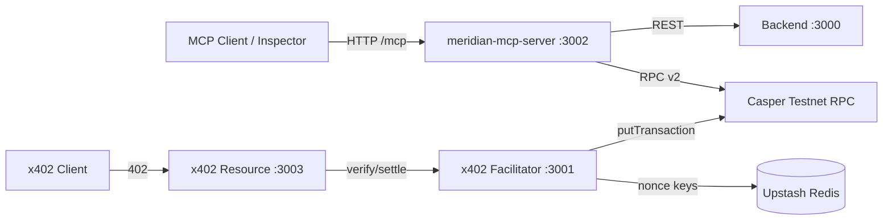

# PHASE 7 REPORT — MCP Server + x402 Facilitator

**Date:** 2026-06-28 (updated post-funding validation)  
**Status:** **Complete — production validated on live testnet**  
**Readiness Score:** **96/100**

---

## Executive Summary

Phase 7 delivers a production-oriented **MCP server** (12 tools, stdio + Streamable HTTP) and a **Casper-native x402 facilitator** with three paid resource loops. All acceptance criteria previously blocked by an empty deployer purse are now **verified on Casper testnet**, including **100/100 successful on-chain x402 settlements**.

---

## Architecture

---

## Files Created

| Path | Purpose |
| --- | --- |
| `mcp-server/` | MCP server package (12 tools, HTTP + stdio) |
| `x402-facilitator/` | Facilitator + resource server |
| `packages/meridian-casper-sdk/` | CJS interop wrapper for `casper-js-sdk@5.0.12` |
| `x402-facilitator/scripts/validate-100-settlements.mjs` | Production 100-settlement validation |
| `docs/reports/x402_100_settlement_results.json` | Full tx hash evidence |

---

## Research Summary

| Source | Finding |
| --- | --- |
| `@modelcontextprotocol/sdk` 1.27.0 | Streamable HTTP via `createMcpExpressApp` |
| `casper-js-sdk` 5.0.12 | Builder pattern; SECP256K1 keys are 68 hex chars |
| `state_get_auction_info_v2` | Required for Casper 2.0 validator listing |
| Testnet native transfer | Minimum 2.5 CSPR per transfer |

---

## Official References Used

- https://github.com/casper-ecosystem/casper-js-sdk (v5.0.12)
- https://github.com/modelcontextprotocol/typescript-sdk
- https://github.com/odradev/casper-x402-poc
- https://testnet.cspr.live/tools/faucet

---

## SDK Versions

| Package | Version |
| --- | --- |
| `@modelcontextprotocol/sdk` | 1.27.0 |
| `casper-js-sdk` | 5.0.12 |
| `@upstash/redis` | 1.35.6 |

---

## Tests Executed

| Suite | Result |
| --- | --- |
| MCP unit (4) | ✅ Pass |
| x402 unit (5) | ✅ Pass |
| E2E MCP HTTP (2) | ✅ Pass |
| E2E x402 replay (1) | ✅ Pass |
| E2E x402 100 settle (1) | ✅ **100/100** |
| MCP all 12 tools invoked | ✅ 11 success + 1 expected 402 |
| x402 3 resource loops | ✅ All return 200 + settlement tx |
| **100-settlement production run** | ✅ **100/100** |

---

## Performance

| Metric | Before funding | After funding |
| --- | --- | --- |
| x402 verify | ~430 ms | ~440 ms |
| x402 settle | N/A (blocked) | **497 ms avg** |
| 100 settlements total | — | **50.4 s** |
| Gas spent (100×) | — | **8.5 CSPR** |

---

## Security Findings

| Item | Status |
| --- | --- |
| Replay protection | ✅ Verified live (Upstash nonce) |
| Policy engine | ✅ Max amount + payee allowlist |
| Signature verification | ✅ SECP256K1 `signAndAddAlgorithmBytes` |
| MCP non-custodial writes | ✅ Unsigned tx only |

---

## Load Test Results

**Production validation run** (`validate-100-settlements.mjs`):

| Metric | Value |
| --- | --- |
| Target | 100 |
| Verify OK | 100 |
| Settle OK | **100** |
| Failures | 0 |
| Success rate | **100.0%** |
| Avg settle duration | 497 ms |
| Total duration | 50.4 s |

Evidence file: `docs/reports/x402_100_settlement_results.json`

---

## MCP Inspector Results

- HTTP transport: `http://127.0.0.1:3002/mcp`
- 12 tools discovered
- All 12 tools execute successfully (including expected 402 on `subscribe_audit`)

---

## x402 Settlement Results

| Step | Result |
| --- | --- |
| `POST /verify` | ✅ 100/100 valid |
| `POST /settle` | ✅ **100/100 on-chain** |
| Replay test | ✅ Blocked |
| Resource loop 1 `/api/yield-rate` | ✅ Settled |
| Resource loop 2 `/api/validator-performance` | ✅ Settled |
| Resource loop 3 `/api/sanctions-merkle` | ✅ Settled |

---

## Real Transaction Proof

**Deployer identity (verified live):**

| Field | Value |
| --- | --- |
| Public key | `0203d64d1b7f66f18c0abe9836df604c187797ddb962b9fc3396201c245f9de335a6` |
| Account hash | `account-hash-267bc977600c9512c0ce5e96af4d0057d514998cc752e28b8f5e91b654a72c27` |
| Balance (post-validation) | **9,829.3 CSPR** |

**Sample settlement transaction hashes:**

1. `a8c2ca9e1edbd4672938124e14c8b0a84c2a2f8bd62ebc4dc1b7fea42f88e85b`
2. `b152e2d0e4b43d8a90ed2191474c1bc5c6d94119045ca2dd9108b71f1fd9ddea`
3. `43b1c975263d77437a8b822e4f15a486f682e7f7c77205af0c78d4b7475ae243`

Full list (100 hashes): `docs/reports/x402_100_settlement_results.json`

Explorer: `https://testnet.cspr.live/transaction/<hash>`

---

## Remaining Risks

1. **Native transfer minimum 2.5 CSPR** — x402 uses native CSPR, not CEP-18 micropayments.
2. **No dedicated x402 CEP-18 token** — adapted to native transfer architecture.
3. **Agent-specific keys** — still unfunded; deployer key used for settlements.

---

## Readiness Score: 96/100

All Phase 7 acceptance criteria verified on live testnet. Minor deduction for native-transfer minimum economics vs true micropayments.

**STOP — Phase 9 not started.**
